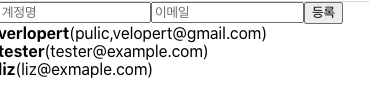

## 13. 배열에 항목 추가하기

배열에 새로운 항목을 추가하는 방법을 알아보자
우선 input 두 개와 button 하나로 이루어진 CreateUser.js 라는 컴포넌트를 src 디렉토리에 만들자

```
|-src
|   |-CreateUser.js
```

- **CreateUser.js**

```javascript
import React from 'react';

function CreateUser({ username, email, onChagne, onCreate}) {
	return (
		<div>
			<input
				name="username"
				placeholder="계정명"
				onChange={onChange}
				onCreate={onCreate}
				value={username}
			/>
			<input
				name="email"
				placeholder="이메일"
				onChange={onChange}
				onCreate={onCreate}
				value={email}
			/>
			<button onClick={onCreate}>등록<button>
		</div>
	);
}
export default CreateUser;
```

- 상태관리를 CreateUser 에서 하지 않고 부모 컴포넌트인 App에서 하게 하고 input의 값 및 이벤트로 등록할 함수(onChange, onReset들을 props로 넘겨받아서 사용하자.

- **App.js**

```javascript
...
return (
	<>
		<CreateUser />
		<UserList users={users} />
	</>
);
```

App.js에 return에 추가.

- 실행화면
  
- 이제 CreateUser 컴포넌트에서 필요한 props를 App에서 준비해주자. -**App.js**

```javascript
import React,  {  useRef  }  from  "react";
import UserList from  "./UserList";
import CreateUser from "./CreateUser";

function  App()  {
	const [inputs, setInputs] = useState({
		username: "",
		email: "",
	})
	const {username,email} = inputs;
	const onChange = (e) =>{
		const {name, value} = e.target;
		setinputs({
			...inputs,
			[name]:value,
		})
	};
	const  users  = [
		{
		id:  1,
		username:  "verlopert",
		email:  "public.velopert@gmail.com",
		},
		{
		id:  2,
		username:  "tester",
		email:  "tester@example.com",
		},
		{
		id:  3,
		username:  "liz",
		email:  "liz@example.com",
		},
	];

	const  nextId  =  useRef(4);

	const  onCreate  =  ()  =>  {
		setInputs({
			username:"",
			email:"",
		});
		nextId.current += 1;
	};

	return {
		<>
			<CreateUser
				username={username}
				email={email}
				onChange={onChange}
				onCreate={onCreate}
			/>
			<UserList  users={users} />;
		</>
	};
}

export  default App;
```

- 이후 users 배열을 컴포넌트 상태로 관리 하기 위해 useState를 적용시킨다. -**App.js**

```javascript
import React,  {  useRef  }  from  "react";
import UserList from  "./UserList";
import CreateUser from "./CreateUser";

function  App()  {
	const [inputs, setInputs] = useState({
		username: "",
		email: "",
	})
	const {username,email} = inputs;
	const onChange = (e) =>{
		const {name, value} = e.target;
		setinputs({
			...inputs,
			[name]:value,
		})
	};
	const  [users, setUsers] = useState([
		{
		id:  1,
		username:  "verlopert",
		email:  "public.velopert@gmail.com",
		},
		{
		id:  2,
		username:  "tester",
		email:  "tester@example.com",
		},
		{
		id:  3,
		username:  "liz",
		email:  "liz@example.com",
		},
	]);

	const  nextId  =  useRef(4);

	const  onCreate  =  ()  =>  {
		const user = {
			...inputs,
			id : nextId.current;
		};
		setUsets([...users,user])
		setInputs({
			username:"",
			email:"",
		});
		nextId.current += 1;
	};

	return {
		<>
			<CreateUser
				username={username}
				email={email}
				onChange={onChange}
				onCreate={onCreate}
			/>
			<UserList  users={users} />;
		</>
	};
}

export  default App;
```

- `onCreate`라는 함수가 실행될 때
  user 라는 새로 받은 inputs의 데이터를 추가해주고 id값까지 추가해준다(current) 이후 setUsers로 ...users(이전의 3개의 배열) + 새로 입력한 users를 추가해준다.
  이후 inputs의 데이터를 초기화하고 nextId.current의 값을 늘려준다

> 객체에서는 객체를 복사 후 특정 값을 대입했다. 배열에서도 기존 배열을 변화시키면 안되고 복사하고 새롭게 변화를 주어야 하는데 이것을 불변성을 지킨다고 말한다. 이 불변성을 지키는 방법에는 크게 2가지가 있는데 첫 번째는 위에 쓴 **spread**를 사용하는 방법이고 두번째는 **concat** 함수를 사용하는 방법이다.
>
> > 예시)
> > arr1 = [1, 2, 3]
> > arr2 = [4, 5, 6]
> > arr3 = arr1.concat(arr2) >> [1,2,3,4,5,6] 인자에 배열이 굳이 안들어가도 되고 배열을 합쳐서 새로운 배열을 생성한다.
>
> ```javascript
> const onCreate = () => {
>   const user = {
>     ...inputs,
>     id: nextId.current,
>   };
>   setUsers(users.concat(users));
>   setInputs({
>     username: "",
>     email: "",
>   });
>   nextId.current += 1;
> };
> ```

이렇게 사용!
