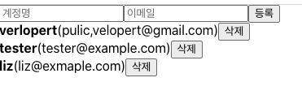

## 14. 배열에 항목 제거하기

우선 UserList 에서 각 User 컴포넌트를 보여줄 때 삭제 버튼을 렌더링해준다

```javascript
import React from "react";

function User({ user, onRemove }) {
  return (
    <div>
      <b>{user.username}</b>
      <span>({user.email})</span>
      <button onClick={() => onRemove(user.id)}>삭제</button>
    </div>
  );
}

function UserList({ users, onRemove }) {
  return (
    <div>
      {users.map((user) => (
        <User user={user} key={User.id} onRemove={onRemove} />
      ))}
    </div>
  );
}

export default UserList;
```

- 실행화면
  
- User 컴포넌트에서 특정 id 값의 User를 삭제하려면 id를 props로 받아와 그 데이터를 삭제해줘야 한다.
- 그러기 위해서 UserList에서 onRemove라는 함수를 받아와서 사용함.

---

### 배열 항목 제거

삭제 시에도 불변성을 지켜가면서 해야하는데 이때 filter 배열 내장 함수를 사용하는 것이 가장 편하다.

- filter 함수

```javascript
arr = [
  {
    id: 1,
    name: "a",
  },
  {
    id: 2,
    name: "b",
  },
  {
    id: 3,
    name: "c",
  },
];
```

위와 같은 배열이 있다고 가정해볼때
`arr.filter(arr => arr.id = 3)` 을 하면 id = 3인 세번째 인자만 가지고 새로운 배열을 만들어준다.

- **App.js**

```javascript
const onRemove = (id) => {
  setUsers(users.filter((users) => user.id != id));
};
```

이렇게 적용시킨다.
