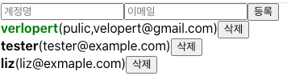

## 15. 배열에 항목 수정하기

배열을 수정하는 방법을 알아보자.

- User 컴포넌트에 계정명을 클릭했을 때 색상이 초록색으로 바뀌고, 다시 누르면 검정색으로 바뀌도록 구현을 해보자.
- App 컴포넌트의 users 배열 안의 객체 안에 active 라는 속성을 추가하자

```javascript
const [users, setUsers] = useState([
  {
    id: 1,
    username: "verlopert",
    email: "pulic,velopert@gmail.com",
    active: true,
  },
  {
    id: 2,
    username: "tester",
    email: "tester@example.com",
    active: false,
  },
  {
    id: 3,
    username: "liz",
    email: "liz@exmaple.com",
    active: false,
  },
]);
```

- **UserList.js** user 컴포넌트만 수정.

```javascript
function User({ user, onRemove }) {
  return (
    <div>
      <b
        style={{
          cursor: "pointer",
          color: user.active ? "green" : "black",
        }}
      >
        {user.username}
      </b>
      <span>({user.email})</span>
      <button onClick={() => onRemove(user.id)}>삭제</button>
    </div>
  );
}
```

- acrtive가 true 면 green, false 면 black을 보여주게 설정.
- 실행화면
  

---

- 이제 onToggle 이라는 함수를 구현하자. 클릭하면 active 속성 값이 바뀌는 기능이다.
- 배열의 불변성을 유지하면서 배열을 업데이트 할 때에도 map 함수를 사용할 수 있다.
- App.js

```javascript
	const onToggle = (id) => {
		setUsers(
			users.map((users) =>
				users.id === id ? {...users, active : !users.active} : users)
	};
```
