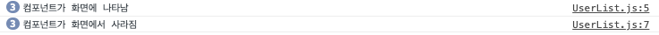

## 16 useEffect를 사용하여 마운트/언마운트/업데이트 할 작업 설정하기

- 마운트 : 최초로 컴포넌트가 설정될 때
- 언마운트 : 컴포넌트가 제거될때

`useEffect`라는 Hook 함수를 사용하여 컴포넌트가 마운트 됐을 때(처음 나타났을 때), 언마운트 됐을 때(사라질 때), 업데이트 될 때(특정 props가 바뀔때) 특정 작업을 처리하는 방법에 대해 알아보자

- **UserList.js**

```javascript
import React, { useEffect } from "react";

function User({ user, onRemove, onToggle }) {
  useEffect(() => {
    console.log("컴포넌트가 화면에 나타남");
    return () => {
      console.log("컴포넌트가 화면에서 사라짐");
    };
  }, []);
  return (
    <div>
      <b
        style={{
          cursor: "pointer",
          color: user.active ? "green" : "black",
        }}
        onClick={() => onToggle(user.id)}
      >
        {user.username}
      </b>
      <span>({user.email})</span>
      <button onClick={() => onRemove(user.id)}>삭제</button>
    </div>
  );
}
```

UserList에서 User 컴포넌트에 useEffect를 사용하는것을 추가함.

- 실행결과
- 
  처음 렌더링 되면 컴포넌트가 화면에 나타남이라는 문장이 3번 반복되고
  삭제를 누를 때 마다 화면에서 사리짐 문장이 log에 찍힌다.

## useEffect

- 첫 번째 파라미터에는 함수, 두번째 파라미터에는 의존값이 들어있는 배열(deps)을 넣는다. 만약 deps 배열을 비우게 된다면, 컴포넌트가 처음 나타날때만 useEffect에 등록된 함수가 호출된다.
- useEffect에서는 함수를 반환 할 수 있는데 이를 cleanup 함수라고 부른다. cleanup 함수는 useEffect에 대한 뒷정리를 해준다고 하는데 deps가 비어있는 경우에는 컴포넌트가 사라질 때 cleanup 함수가 호출된다.
- 주로 마운트 시에 하는 작업들은 다음과 같다
  - props로 받은 컴포넌트의 로컬 상태로 설정
  - 외부API 요청(REST API등)
  - 라이브러리 사용(D3, video.js등)
  - setInterval을 통한 반복작업 혹은 setTimeout 을 통한 작업 예약
- 언 마운트시에 하는 작업들
  - setInterval, setTimeout 을 사용하여 등록한 작업들 clear 하기(clearInterval, clearTimeout)
  - 라이브러리 인스턴스 제거

## deps에 특정 값 넣기

이번에는 deps에 특정 값을 넣는다. deps에 특정 값을 넣게 된다면 컴포넌트가 처음 마운트 될 때도 호출이 되고 지정한 값이 바뀔 때도 호출이 된다. deps 안에 특정 값이 있다면 언마운트시에도 호출이 되고 값이 바뀌기 직전에도 호출이 된다.

```javascript
useEffect(() => {
  console.log("user 값이 설정됨");
  console.log(user);
  return () => {
    console.log("user가 바뀌기 전..");
    console.log(user);
  };
}, [user]);
```

- useEffect 안에서 사용하는 상태나, props가 있다면, useEffect 의 deps에 넣어주어야 한다.(규칙)
- 만약 useEffect 안에서 사용하는 상태나 props를 deps에 넣지 않게 된다면 useEffect에 등록한 함수가 실행 될 때 최신 props 상태를 기르키지 않게 된다.

### deps 파라미터 생략하기

```javascript
useEffect(() => {
  console.log(user);
});
```

- deps 를 생략하게 된다면 컴포넌트가 리렌더링될때마다 호출이 된다. input 창에 적을때마다 콘솔이 찍힌다....
- 실제 DOM에만 변화가 반영되는 것은 바뀐 내용이 있는 컴포넌트에만 해당한다. 하지만 Virtual DOM 에는 모든껄 다 렌더링 하고 있다.
