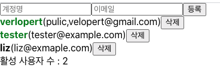

# 17. useMemo 를 사용하여 연산한 값 재사용하기

- 성능 최적화를 위하여 연산된 값을 `useMemo`라는 Hook 을 사용하여 재사용 해보자
- App컴포넌트에 다음과 같이 countActiveUsers라는 함수를 만들어서, active 값이 true 인 사용자의 수를 세어서 화면에 렌더링해보자

- **App.js**

```javascript
function countActiveUsers(user){
	console.log("활성 사용자 수를 세는 중 .. ")
	return user.filter((user) => user.active).length;
}
...
const count = countActiveUsers(users);
...
return{
...
	<div>활성 사용자 수 : {count}</div>
...
}
```

- 실행화면
  
  여기서 문제가 발생하는데 input 값을 바꿀 때도 countActiveUsers 함수가 호출되어 console.log가 찍힌다. users에 변화가 있을 때만 호출되어야 하지만 input 값이 바뀔 때에도 컴포넌트가 리렌더링 되므로 불필요할때 호출되어 자원이 낭비된다.
- 이 상태에서 사용하는게 useMemo이다.

```javascript
import React, { useRef, useState, useMemo } from "react";
import CreateUser from "./CreateUser";
import UserList from "./UserList";

function countActiveUsers(user) {
  console.log("활성 사용자 수를 세는 중..");
  return user.filter((user) => user.active).length;
}
function App() {
  const [inputs, setinputs] = useState({
    username: "",
    email: "",
  });

  const { username, email } = inputs;

  const onChange = (e) => {
    const { name, value } = e.target;
    setinputs({
      ...inputs,
      [name]: value,
    });
  };

  const [users, setUsers] = useState([
    {
      id: 1,
      username: "verlopert",
      email: "pulic,velopert@gmail.com",
      active: true,
    },
    {
      id: 2,
      username: "tester",
      email: "tester@example.com",
      active: false,
    },
    {
      id: 3,
      username: "liz",
      email: "liz@exmaple.com",
      active: false,
    },
  ]);

  const nextId = useRef(4);

  const onCreate = () => {
    const user = {
      id: nextId.current,
      username,
      email,
    };
    setUsers(users.concat(user));
    setinputs({
      username: "",
      email: "",
    });
    nextId.current += 1;
  };

  const onRemove = (id) => {
    setUsers(users.filter((users) => users.id !== id));
  };

  const onToggle = (id) => {
    setUsers(
      users.map((users) =>
        users.id === id ? { ...users, active: !users.active } : users
      )
    );
  };
  const count = useMemo(() => countActiveUsers(users), [users]);

  return (
    <>
      <CreateUser
        username={username}
        email={email}
        onChange={onChange}
        onCreate={onCreate}
      />
      <UserList users={users} onRemove={onRemove} onToggle={onToggle} />
      <div>활성 사용자 수 : {count}</div>
    </>
  );
}

export default App;
```

```javascript
const count = useMemo(() => countActiveUsers(users), [users]);
```

- useMemo 함수에 첫 번째 파라미터에는 어떻게 연산할지 정의하는 함수를 넣어주고 두번째 파라미터에는 deps 배열을 넣어주면 된다.
- useMemo를 사용할때 배열 안에 넣은 내용이 바뀌면 등록한 함수를 호출해여 값을 연산하고 deps의 내용이 바뀌지 않으면 이전에 연산한 값을 재사용한다.
