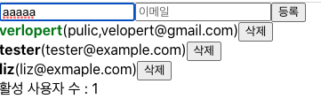
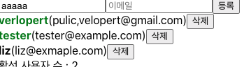
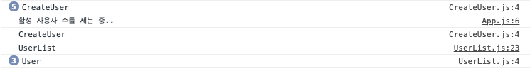

# 19. React.memo 를 사용한 컴포넌트 리렌더링 방지

지금까지는 값, 함수를 최적화 했다면 이번에는 컴포넌트의 props 가 바뀌지 않았다면, 리렌더링을 방지하여 리렌더링 성능 최적화를 해줄 수 있는 React.memo 라는 함수에 대해서 알아보자.

사용법은 그냥 export 되는 컴포넌트를 감싸주면 된다.

- CreateUser.js

```javascript
import React from 'react';
function CreateUser() {
	console.log("CreateUser");
}
...
export default React.memo(CreateUser);
```

- UserList와 User 컴포넌트에도 적용시켜보자

```javascript
import React from 'react';
const User = React.memo(function User({user, onRemove, onToggle}){
	console.log("User");
...
});
function UserList(){
	console.log("UserList");
}
...
export default React.memo(UserList);
```




이전에 전체가 리렌더링 되는것에서 CreatUser만 리렌더링 된다.
근데 User 중 하나라도 수정하면 모든 User가 리렌더링 되고 CreateUser도 리렌더링 된다.

tester 유저의 active를 바꿈.(검정> 초록)

전체가 리렌더링된다.

- 전체가 리렌더링되는 원인은 users 배열이 바뀔때마다 onCreate onToggle onRemove도 새로 만들어지기 때문이다.
- deps에 users가 들어있기 때문에 배열이 바뀔때마다 함수가 새로 만들어지는것은 당연하다. 이걸 최적화 하려면 deps에서 users를 지우고 함수들에서 현재 useState로 관리하는 users를 참조하지 않게 하는 것이다.

## 함수형 업데이트

함수형 업데이트를 하면 setUsers에 등록하는 콜백함수의 파라미터에서 최신 users를 참조 할 수 있기 때문에 deps에 users를 넣지 않아도 된다.

- **App.js**

```javascript
import React, { useRef, useState, useMemo, useCallback } from "react";
import CreateUser from "./CreateUser";
import UserList from "./UserList";

function countActiveUsers(user) {
  return user.filter((user) => user.active).length;
}
function App() {
  const [inputs, setinputs] = useState({
    username: "",
    email: "",
  });

  const { username, email } = inputs;

  const onChange = useCallback(
    (e) => {
      const { name, value } = e.target;
      setinputs((inputs) => ({
        ...inputs,
        [name]: value,
      }));
    },
    [inputs]
  );

  const [users, setUsers] = useState([
    {
      id: 1,
      username: "verlopert",
      email: "pulic,velopert@gmail.com",
      active: true,
    },
    {
      id: 2,
      username: "tester",
      email: "tester@example.com",
      active: false,
    },
    {
      id: 3,
      username: "liz",
      email: "liz@exmaple.com",
      active: false,
    },
  ]);

  const nextId = useRef(4);

  const onCreate = useCallback(() => {
    const user = {
      id: nextId.current,
      username,
      email,
    };
    setUsers((users) => users.concat(user));
    setinputs({
      username: "",
      email: "",
    });
    nextId.current += 1;
  }, [username, email]);

  const onRemove = useCallback((id) => {
    setUsers((users) => users.filter((users) => users.id !== id));
  }, []);

  const onToggle = useCallback((id) => {
    setUsers((users) =>
      users.map((users) =>
        users.id === id ? { ...users, active: !users.active } : users
      )
    );
  }, []);
  const count = useMemo(() => countActiveUsers(users), [users]);

  return (
    <>
      <CreateUser
        username={username}
        email={email}
        onChange={onChange}
        onCreate={onCreate}
      />
      <UserList users={users} onRemove={onRemove} onToggle={onToggle} />
      <div>활성 사용자 수 : {count}</div>
    </>
  );
}

export default App;
```

보면 각 함수의 Setter 함수에다가 함수형 업데이트 형식(기존 배열 => 업데이트) 형식으로 바꿔주고 deps를 제거했다.

- 리액트 개발을 할 때 userCallback, useMemo, React.memo는 컴포넌트의 성능을 실제로 개선할 수 있는 상황에서만 해야한다.
- 예를들어 User 컴포넌트에서 b와 button에 onClick으로 설정해준 함수들은 해당 함수들을 useCallback으로 재사용한다고 해서 리렌더링을 막을 수 있는것이 아니다
- 추가적으로 렌더링 최적화를 하지 않을 컴포넌트에 React.memo를 사용하는 것은 불필요한 props 비교만 하는 것이기 때문에 실제로 렌더링을 방지할 수 있는 상황에만 사용해야한다

추가적으로 React.memo에서 두번째 파라미터에 propsAreEqual 이라는 함수를 사용하여 특정 값들만 비교를 하는것도 가능하다.

```javascript
export default React.memo(
  UserList,
  (prevProps, nextProps) => prevProps.users === nextProps.users
);
```

UserList의 props는 users, onToggle, onRemove 3가지인데 onToggle와 onRemove는 useCallback를 해서 고정이고 users만 비교를 한다고 해서 저렇게 코드를 짰으나

만약 이렇게 users만 비교를 하는데 함수들이 변경되게 되면 오류가 발생할 수 있다.
