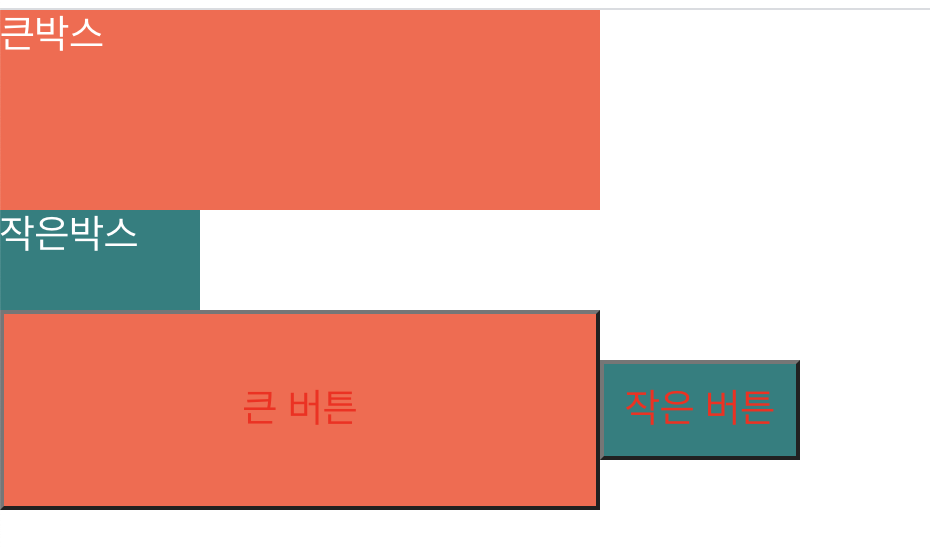
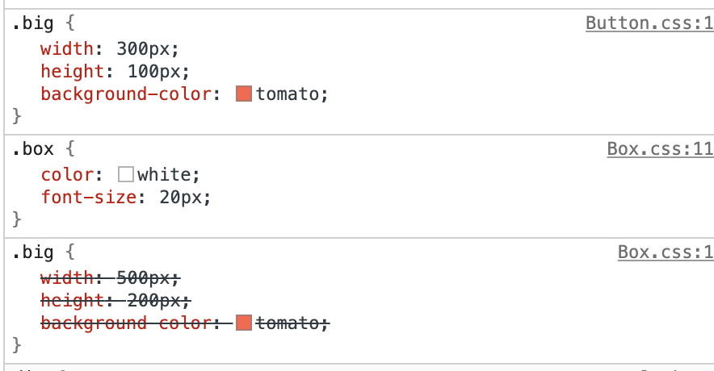
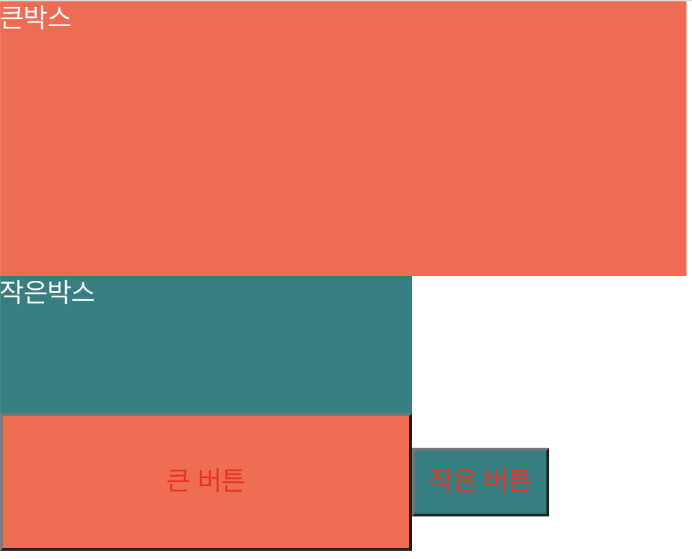
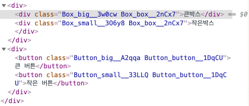
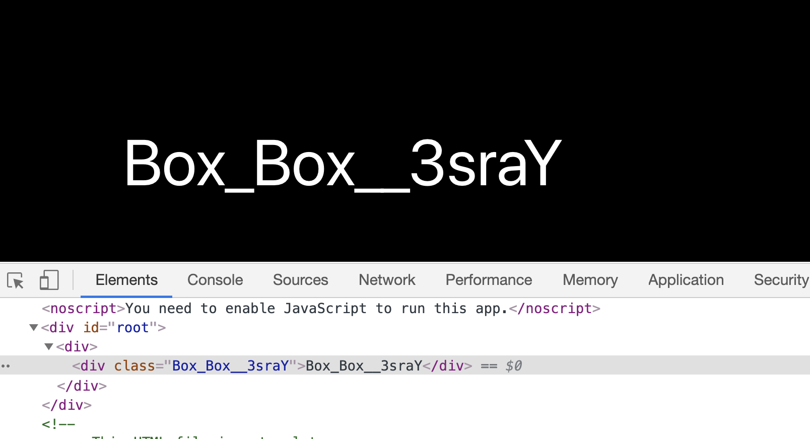
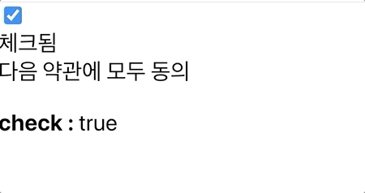
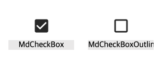
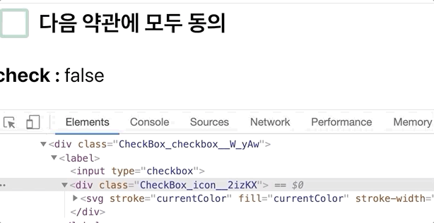

# CSS Module

**왜 CSS Module을 써야 하는가**

- CSS Module 라는 기술을 사용하면 리액트 프로젝트에서 CSS 클래스가 중첩되는 것을 완벽히 방지할 수 있다.
- 예시 , [kwonh 님의 블로그](https://velog.io/@kwonh/React-CSS%EB%A5%BC-%EC%9E%91%EC%84%B1%ED%95%98%EB%8A%94-%EB%B0%A9%EB%B2%95%EB%93%A4-css-module-sass-css-in-js) 의 예시를 참고함.
- 일반적인 CSS로 Box와 Button을 만들자
- **Box.css**

```css
.big {
  width: 500px;
  height: 200px;
  background-color: tomato;
}
.small {
  width: 300px;
  height: 100px;
  background-color: teal;
}
.box {
  color: white;
  font-size: 20px;
}
```

- **Button.css**

```css
.big {
  width: 300px;
  height: 100px;
  background-color: tomato;
}
.small {
  width: 100px;
  height: 50px;
  background-color: teal;
}
.button {
  color: red;
  font-size: 20px;
}
```

- 보면 박스와 버튼의 차이는 크기가 다르고 color 색깔이 다른걸 확인할 수 있다.
- **Box.js**, **Button.js**

```javascript
//Box.js
import React from "react";
import "./Box.css";

function Box() {
  return (
    <div>
      <div className="big box">큰박스</div>
      <div className="small box">작은박스</div>
    </div>
  );
}

export default Box;

//Button.js
import React from "react";
import "./Button.css";

function Button() {
  return (
    <div>
      <button className="big button">큰버튼</button>
      <button className="small button">작은버튼</button>
    </div>
  );
}

export default Button;
```




- 하지만 둘의 크기가 같게 나온다. 적용된 css를 보면 Box.css의 .big이 적용 안된걸 볼 수 있다(className 중복). 이걸 CSS Module로 변경을 하면
- **Box.js**

```javascript
import React from "react";
import classNames from "classnames";
import styles from "./Box.module.css";

function Box() {
  return (
    <div>
      <div className={classNames(styles.big, styles.box)}>큰박스</div>
      <div className={classNames(styles.small, styles.box)}>작은박스</div>
    </div>
  );
}

export default Box;
```

- **Button.js**

```javascript
import React from "react";
import classNames from "classnames";
import styles from "./Button.module.css";

function Button() {
  return (
    <div>
      <button className={classNames(styles.big, styles.button)}>큰 버튼</button>
      <button className={classNames(styles.small, styles.button)}>
        작은 버튼
      </button>
    </div>
  );
}

export default Button;
```




- 각 class의 name이 변경된걸 볼 수 있다.
- 이제 CSS Module에 대해 정확히 알아보자

## CSS Module사용

CRA(create-react-app)으로 만든 프로젝트에서 CSS Module를 사용할 때 CSS 파일의 확장자를 `.module.css` 로 하면 되는데 예시로 `Box.module.css`라는 파일을 만들면

- **Box.module.css**

```css
.Box {
  background: black;
  color: white;
  padding: 2rem;
}
```

- 리액트 컴포넌트 파일에서 해당 CSS 파일을 불러올 때 CSS 파일에 선언한 클래스 이름들이 모두 고유해진다.
- 고유 CSS 클래스 이름이 만들어지는 과정에서는 파일 경로, 파일 이름, 클래스 이름. 해쉬값등이 사용 될 수 있다.
- 예를들어 Box 컴포넌트를 만든다면
- **Box.js**

```javascript
import React from "react";
import styles from "./Box.module.css";

function Box() {
  return <div className={styles.Box}>{styles.Box}</div>;
}

export default Box;
```

- 일반 CSS처럼 그냥 import 하는 것이 아닌 styles 라는 객체로 CSS 모듈 파일의 내용을 불러오며 객체 안에 있는 값을 참조해야 한다
- 
- 위 처럼 클래스 이름에 대하여 고유한 이름들이 만들어지기 때문에 실수로 CSS 클래스 이름이 중복되는 일에 대하여 걱정할 필요가 없어진다
- 다음과 같은 상황에서 유용하다

  - 레거시 프로젝트에 리액트를 도입할 때(기존 프로젝트에 있던 CSS 클래스와 이름이 중복되어도 스타일이 꼬이지 않게 해준다)
  - CSS 클래스를 중복되지 않게 작성하기 위해 CSS 클래스 네이밍 규칙을 만들기 귀찮을 때

- 리액트 컴포넌트를 위한 클래스를 작성할 때 CSS 클래스 네이밍 규칙
  1. 컴포넌트의 이름은 다른 컴포넌트와 중복되지 않게 한다
  2. 컴포넌트의 최상단 CSS 클래스는 컴포넌트의 이름과 일치시킨다
  3. 컴포넌트 내부에서 보여지는 CSS 클래스는 CSS Selector를 잘 활용한다.

다음은 CSS Module 기술을 사용해 커스텀 체크박스 컴포넌트를 만드는 방법을 배우자

- **components/CheckBox.js**

```javascript
import React from "react";

function CheckBox({ children, checked, ...rest }) {
  return (
    <div>
      <label>
        <input type="checkbox" checked={checked} {...rest} />
        <div>{checked ? "체크됨" : "체크안됨"}</div>
      </label>
      <span>{children}</span>
    </div>
  );
}

export default CheckBox;
```

단순한 HTML 태그들만 미리 선언, `...rest` 를 사용해 input에 말고 다른곳에 쓸 children과 checked를 제외한 나머지를 input에 넣어 준다

- **App.js**

```javascript
import React, { useState } from "react";
import CheckBox from "./components/CheckBox";

function App() {
  const [check, setCheck] = useState(false);
  const onChange = (e) => {
    setCheck(e.target.checked);
  };
  return (
    <div>
      <CheckBox onChange={onChange} checked={check}>
        다음 약관에 모두 동의
      </CheckBox>
      <p>
        <b> check : </b>
        {check ? "true" : "false"}
      </p>
    </div>
  );
}

export default App;
```

- 여기서 `e.target.checked`는 현재 target 되는 이벤트의 체크 여부를 확인해서 boolean 값으로 반환한다.
- 실행화면
  

스타일링을 해보자!
`react-icons` 라는 라이브러리를 사용하면 아이콘들을 컴포넌트 형태로 쉽게 사용할 수 있다.
해당 라이브러리 https://react-icons.github.io/react-icons/#/ 에서 원하는 아이콘을 불러와서 사용할 수 있다.

이 아이콘들을 사용해 보자!

- **components/CheckBox.js**

```javascript
import React from "react";
import { MdCheckBox, MdCheckBoxOutlineBlank } from "react-icons/md";

function CheckBox({ children, checked, ...rest }) {
  return (
    <div>
      <label>
        <input type="checkbox" checked={checked} {...rest} />
        <div>{checked ? <MdCheckBox /> : <MdCheckBoxOutlineBlank />}</div>
      </label>
      <span>{children}</span>
    </div>
  );
}
export default CheckBox;
```

이렇게 수정을 하면 텍스트 대신 아이콘이 나타난다. 이제 스타일링을 해보자

- **components/CheckBox.module.css**

```css
.checkbox {
  display: flex;
  align-items: center;
}
.checkbox label {
  cursor: pointer;
}
/* 실제 input을 숨기기 위한 코드 */
.checkbox input {
  width: 0;
  height: 0;
  position: absolute;
  opacity: 0;
}

.checkbox span {
  font-size: 1.125rem;
  font-weight: bold;
}

.icon {
  display: flex;
  align-items: center;
  /*아이콘의 크기는 폰트 사이즈로 조정 가능 */
  font-size: 2rem;
  margin-right: 0.25rem;
  color: #abd5bd;
}
.checked {
  color: #339af0;
}
```

- CSS Module을 작성할 때에는 CSS 클래스 이름이 다른 곳에서 사용되는 CSS 클래스 이름과 중복될 일이 없기 때문에 `.icon`, `.checkbox`같은 흔한이름을 사용해도 상관 없다.
- 다시 css을 적용해보면
- **components/CheckBox.js**

```javascript
import React from "react";
import { MdCheckBox, MdCheckBoxOutlineBlank } from "react-icons/md";
import styles from "./CheckBox.module.css";

function CheckBox({ children, checked, ...rest }) {
  return (
    <div className={styles.checkbox}>
      <label>
        <input type="checkbox" checked={checked} {...rest} />
        <div className={styles.icon}>
          {checked ? (
            <MdCheckBox className={styles.checked} />
          ) : (
            <MdCheckBoxOutlineBlank />
          )}
        </div>
      </label>
      <span>{children}</span>
    </div>
  );
}

export default CheckBox;
```

- 

- 만약 클래스 이름에 `-`이 들어있는 경우에는 `styles[my-class]` 이런 형식으로 작성을 해야하며
- 여러개의 클래스를 적용시켜야 하면 `${styles.one} ${styles.two}` 이렇게 작성해야한다..
- `classnames`라는 라이브러리를 적용하면 손쉽게 CSS Module을 사용할 수있다.

설치

```
yarn add classnames
```

- **components/CheckBox.js**

```javascript
import React from "react";
import { MdCheckBox, MdCheckBoxOutlineBlank } from "react-icons/md";
import styles from "./CheckBox.module.css";
import classNames from "classnames/bind";

const cx = classNames.bind(styles);

function CheckBox({ children, checked, ...rest }) {
  return (
    <div className={cx("checkbox")}>
      <label>
        <input type="checkbox" checked={checked} {...rest} />
        <div className={cx("icon")}>
          {checked ? (
            <MdCheckBox className={cx("checked")} />
          ) : (
            <MdCheckBoxOutlineBlank />
          )}
        </div>
      </label>
      <span>{children}</span>
    </div>
  );
}

export default CheckBox;
```

- classnames 의 `bind` 기능을 사용하면 CSS 클래스 이름을 지정해줄 때 `cx('클래스 이름')`과 같은 형식으로 편하게 사용할 수 있다.
