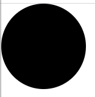
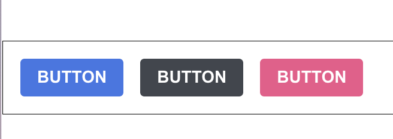
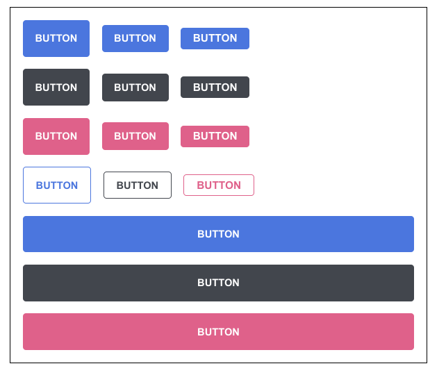
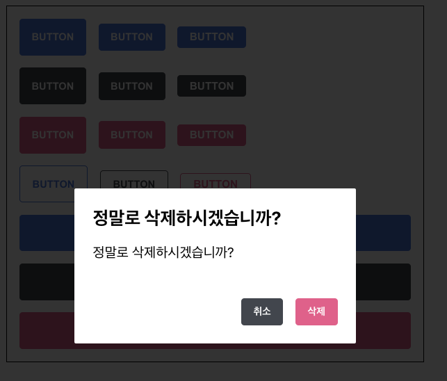
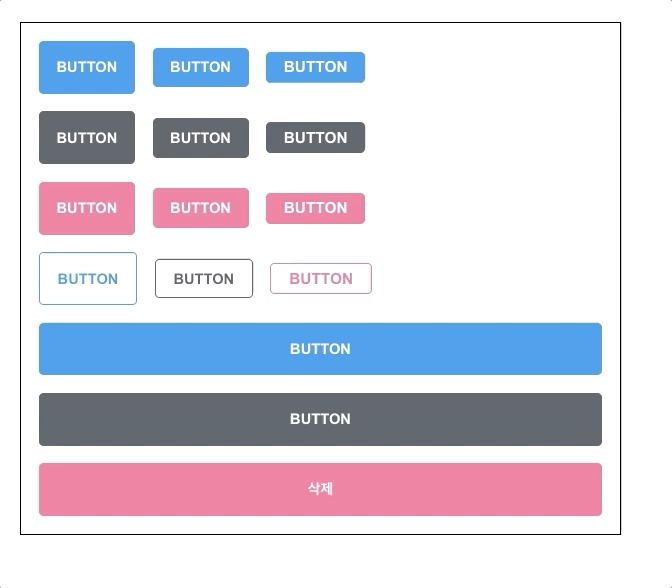
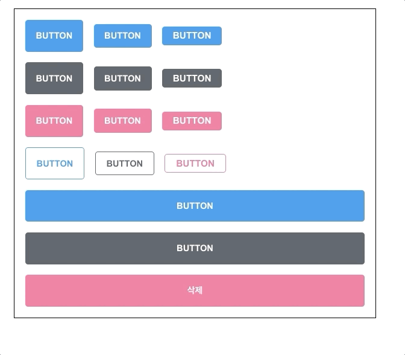

# styled-components

이번에 배워볼 기술은 **CSS in JS** 라는 기술이다. 말 그대로 JS 안에 CSS를 작성하는것을 말하는데 정확히는 해당 기술을 사용하는 라이브러리인 styled-components 를 다뤄본다.

## Tagged Template Literal

- styled-components를 사용하기 전 Tagged Template Literal 이라는 문법을 알아보자
- 아래 예시는 기존에 알고 있는 Template Literal 이다. ES6

```javascript
const name = "react";
const message = `hello ${name}`;

console.log(message);
// 'hello react'
```

문자열 안에 변수를 쓰기위해 ${} 표현식을 사용하고 `(백틱)으로 감싸줌
하지만 안에 객체나 함수를 넣는다면 어떻게 될까

```javascript
const object = { a: 1 };
const text = `${object}`;
console.log(text);
// '[object object]' > 값을  조회할수 없음
const fn = () => true;
const msg = `${fn}`;
consol.log(msg);
// '() => true ' > 함수 전체가 출력
```

만약 Template Literal 을 사용하면서 그 내부에 넣은 자바스크립트 값을 조회하고 싶을 땐 **Tagged Template Literal**을 사용하면 된다.

- 간단한 예시를 들어보자

```javascript
const red = "빨강색";
const blue = "파란색";
function favoriteColors(texts) {
  console.log(texts);
}
favoriteColors(`제가 좋아하는 색은 ${red}와 ${blue}입니다.`);
//실행결과 : 제가 좋아하는 색은 빨강색과 파란색입니다.
favoriteColors`제가 좋아하는 색은 ${red}와 ${blue}입니다.`;
//실행결과 :["제가 좋아하는 색은 ", "와 ", "입니다.", raw: Array(3)]
```

- **Tagged Template** 은 함수를 실행시킬때 `(백틱)을 괄호에 넣는 것이 아닌 바로 함수 옆에다 적어준다.
- **Tagged Template**을 사용하면 Template Literal을 함수로 파싱할 수 있다.

```javascript
function favoriteColor(texts, ...values){
	console.log(texts);
	console.log(values);
}
favoriteColor(`제가 좋아하는 색은 ${red}와 ${blue}입니다.`)
//실행결과 : 제가 좋아하는 색은 빨강색과 파란색입니다.
		   []
favoriteColor`제가 좋아하는 색은 ${red}와 ${blue}입니다.`
//실행결과 : ["제가 좋아하는 색은 ", "와 ", "입니다", raw: Array(3)]
//        ["빨강색", "파란색"]
```

- **Tagged Template** 를 사용한 함수의 첫 번째 인자는 문자열 값의 배열, 나머지 인자는 표현식들이다.
- 위에서 2번째 인자에 `rest`문법을 사용해서 사용한 표현식들을 모두 반환하고 있다. 위 실행결과처럼 **Tagged Template** 을 사용하면 **Template Literal**을 파싱해서 반환시킨다.

```javascript
function sample(texts, ...fns) {
  const mockProps = {
    title: "안녕하세요",
    body: "내용은 ...입니다",
  };
  return texts.reduce(
    (result, text, i) => `${result}${text}${fns[i] ? fns[i](mockProps) : ""}`,
    ""
  );
}
sample`
	제목 : ${(props) => props.title}
	내용 : ${(props) => props.body} 
`;
//실행결과: 제목 : 안녕하세요 내용: 내용은 ...입니다
```

- 위의 코드에서 주목해야할 점은 **Tagged Template** 을 사용했기에 reduce 함수에서 ...fns로 받아온 표현식의 배열을 활용할 수 있다는 점이다.

<br>

## styled-components 사용하기

styled-components를 설치하자

```
yarn add styled-components
```

- App.js

```javascript
import React from "react";
import styled from "styled-components";

const Circle = styled.div`
  width: 5rem;
  height: 5rem;
  background: black;
  border-radius: 50%;
`;

function App() {
  return <Circle />;
}
export default App;
```

- 
- `styled.div` 에서 div라는 태그함수에 백틱을 넣어서 안에 값을 넣어준다.(Tagged Template 사용)
- props로 값을 주고 싶으면

```javascript
import React from "react";
import styled from "styled-components";

const Circle = styled.div`
  width: 5rem;
  height: 5rem;
  background: ${(props) =>
    props.color}; //props를 받아와 background에 props.color값을입력
  border-radius: 50%;
`;

function App() {
  return <Circle color="blue" />;
}
export default App;
```

- 이렇게 함수 형식으로 전달받은 props에서 값을 사용한다.

```javascript
import React from "react";
import styled, { css } from "styled-components";

const Circle = styled.div`
  width: 5rem;
  height: 5rem;
  background: ${(props) => props.color};
  border-radius: 50%;
  ${(props) =>
    props.huge &&
    css`
      width: 10rem;
      height: 10rem;
    `}
`;

function App() {
  return <Circle color="blue" />;
}
export default App;
```

- huge라는 props가 있으면 크기를 키우는 조건을 만족하려면 위처럼 코드를 작성하는데
- 표현식 안에 조건형식으로 그냥 css를 넣어도 되지만 Tagged Template를 사용하기 위해서 css함수를 import해줘서 사용한다.

<br>

## Button 만들기!

```javascript
import React from "react";
import styled from "styled-components";

const StyledButton = styled.button`
  /* 공통 스타일 */
  display: inline
  outline: none;
  border: none;
  border-radius: 4px;
  color: white;
  font-weight: bold;
  cursor: pointer;
  padding-left: 1rem;
  padding-right: 1rem;

  /* 크기 */
  height: 2.25rem;
  font-size: 1rem;

  /* 색상 */
  background: #228be6;
  &:hover {
    background: #339af0;
  }
  &:active {
    background: #1c7ed6;
  }

  /* 기타 */
  & + & {
    margin-left: 1rem;
  }
`;

function Button({ children, ...rest }) {
  return <StyledButton {...rest}>{children}</StyledButton>;
}

export default Button;
```

```javascript
import React from "react";
import styled from "styled-components";
import Button from "./components/Button";

const AppBlock = styled.div`
  width: 512px;
  margin: 0 auto;
  margin-top: 4rem;
  border: 1px solid black;
  padding: 1rem;
`;

function App() {
  return (
    <AppBlock>
      <Button>BUTTON</Button>
    </AppBlock>
  );
}

export default App;
```

간단한 버튼을 만드는 예제.

<br>

## polished의 스타일 관련 유틸 함수 사용하기

- polished 라는 라이브러리를 사용하면 색상에 변화를 줄 수 있는 유틸 함수를 쉽게 이용 가능하다.
- [polished](https://polished.js.org/docs/) 라이브러리 설명
- 기존 색상 부분을 유틸함수로 대체하자

```javascript
import React from "react";
import styled from "styled-components";
import { darken, lighten } from "polished";

const StyledButton = styled.button`
  /* 공통 스타일 */
  display: inline-flex;
  outline: none;
  border: none;
  border-radius: 4px;
  color: white;
  font-weight: bold;
  cursor: pointer;
  padding-left: 1rem;
  padding-right: 1rem;

  /* 크기 */
  height: 2.25rem;
  font-size: 1rem;

  /* 색상 */
  background: #228be6;
  &:hover {
    background: ${lighten(0.1, "#228be6")}; //background와 같은 색상이여함.
  }
  &:active {
    background: ${darken(0.1, "#228be6")};
  }

  /* 기타 */
  & + & {
    margin-left: 1rem;
  }
`;

function Button({ children, ...rest }) {
  return <StyledButton {...rest}>{children}</StyledButton>;
}

export default Button;
```

## ThemeProvider로 전역값 설정

다른 색상의 버튼을 만드는데 `ThemeProvider` 라는 기능을 사용해서 styled-components 로 만드는 모든 컴포넌트에서 조회하여 사용할 수 있는 전역값을 설정할 수 있다.

- App.js

```javascript
import React from "react";
import styled, { ThemeProvider } from "styled-components";
import Button from "./components/Button";

const AppBlock = styled.div`
  width: 512px;
  margin: 0 auto;
  margin-top: 4rem;
  border: 1px solid black;
  padding: 1rem;
`;

function App() {
  return (
    <ThemeProvider
      theme={{
        palette: {
          blue: "#228be6",
          gray: "#495057",
          pink: "#f06595",
        },
      }}
    >
      <AppBlock>
        <Button>BUTTON</Button>
      </AppBlock>
    </ThemeProvider>
  );
}

export default App;
```

- 위에 처럼 `theme`을 설정하면 ThemeProvider 내부에 렌더링된 styled-components로 만든 컴포넌트(Button)에서 `palette`를 조회해서 사용할 수 있다.
- Button.js

```javascript
/* 색상 */
${props => {
    const selected = props.theme.palette.blue;
    return css`
      background: ${selected};
      &:hover {
        background: ${lighten(0.1, selected)};
      }
      &:active {
        background: ${darken(0.1, selected)};
      }
}
```

- 지금은 `props.theme` 로ThemeProvider로 설정한 값들을 받아올 수 있다. 지금은 palette.blue라고 직접 지정해줬지만 color라는 props를 만들어 props에 따라 값이 바뀌게 설정하자

```javascript
${props => {
    const selected = props.theme.palette[props.color];
    return css`
      background: ${selected};
      &:hover {
        background: ${lighten(0.1, selected)};
      }
      &:active {
        background: ${darken(0.1, selected)};
      }
    `;
  }}
```

App.js

```javascript
import React from "react";
import styled, { ThemeProvider } from "styled-components";
import Button from "./components/Button";

const AppBlock = styled.div`
  width: 512px;
  margin: 0 auto;
  margin-top: 4rem;
  border: 1px solid black;
  padding: 1rem;
`;

function App() {
  return (
    <ThemeProvider
      theme={{
        palette: {
          blue: "#228be6",
          gray: "#495057",
          pink: "#f06595",
        },
      }}
    >
      <AppBlock>
        <Button>BUTTON</Button>
        <Button color="gray">BUTTON</Button>
        <Button color="pink">BUTTON</Button>
      </AppBlock>
    </ThemeProvider>
  );
}

export default App;
```



## Button 컴포넌트 리팩토링

```javascript
mport React from 'react';
import styled, { css } from 'styled-components';
import { darken, lighten } from 'polished';

const colorStyles = css`
  ${({ theme, color }) => {
    const selected = theme.palette[color];
    return css`
      background: ${selected};
      &:hover {
        background: ${lighten(0.1, selected)};
      }
      &:active {
        background: ${darken(0.1, selected)};
      }
    `;
  }}
`;

const StyledButton = styled.button`
  /* 공통 스타일 */
  display: inline-flex;
  outline: none;
  border: none;
  border-radius: 4px;
  color: white;
  font-weight: bold;
  cursor: pointer;
  padding-left: 1rem;
  padding-right: 1rem;

  /* 크기 */
  height: 2.25rem;
  font-size: 1rem;

  /* 색상 */
  ${colorStyles}

  /* 기타 */
  & + & {
    margin-left: 1rem;
  }
`;

function Button({ children, color, ...rest }) {
  return <StyledButton color={color} {...rest}>{children}</StyledButton>;
}

Button.defaultProps = {
  color: 'blue'
};

export default Button;
```

- 비구조화 할당으로 props.theme 이렇게 조회하는걸 바로 조회하게 바꿈, 색상에 관련된 코드를 컴포넌트에서 분리해서 사용할 수 있게 만듬 -> 유지보수 편해짐.
- size props를 설정해서 버튼 크기 설정하기

```javascript
import React from "react";
import styled, { css } from "styled-components";
import { darken, lighten } from "polished";

const colorStyles = css`
  ${({ theme, color }) => {
    const selected = theme.palette[color];
    return css`
      background: ${selected};
      &:hover {
        background: ${lighten(0.1, selected)};
      }
      &:active {
        background: ${darken(0.1, selected)};
      }
    `;
  }}
`;

const sizeStyles = css`
  ${(props) =>
    props.size === "large" &&
    css`
      height: 3rem;
      font-size: 1.25rem;
    `}

  ${(props) =>
    props.size === "medium" &&
    css`
      height: 2.25rem;
      font-size: 1rem;
    `}

    ${(props) =>
    props.size === "small" &&
    css`
      height: 1.75rem;
      font-size: 0.875rem;
    `}
`;

const StyledButton = styled.button`
  /* 공통 스타일 */
  display: inline-flex;
  outline: none;
  border: none;
  border-radius: 4px;
  color: white;
  font-weight: bold;
  cursor: pointer;
  padding-left: 1rem;
  padding-right: 1rem;

  /* 크기 */
  ${sizeStyles}

  /* 색상 */
  ${colorStyles}

  /* 기타 */
  & + & {
    margin-left: 1rem;
  }
`;

function Button({ children, color, size, ...rest }) {
  return (
    <StyledButton color={color} size={size} {...rest}>
      {children}
    </StyledButton>
  );
}

Button.defaultProps = {
  color: "blue",
  size: "medium",
};

export default Button;
```

App.js

```javascript
import React from "react";
import styled, { ThemeProvider } from "styled-components";
import Button from "./components/Button";

const AppBlock = styled.div`
  width: 512px;
  margin: 0 auto;
  margin-top: 4rem;
  border: 1px solid black;
  padding: 1rem;
`;

const ButtonGroup = styled.div`
  & + & {
    margin-top: 1rem;
  }
`;

function App() {
  return (
    <ThemeProvider
      theme={{
        palette: {
          blue: "#228be6",
          gray: "#495057",
          pink: "#f06595",
        },
      }}
    >
      <AppBlock>
        <ButtonGroup>
          <Button size="large">BUTTON</Button>
          <Button>BUTTON</Button>
          <Button size="small">BUTTON</Button>
        </ButtonGroup>
        <ButtonGroup>
          <Button color="gray" size="large">
            BUTTON
          </Button>
          <Button color="gray">BUTTON</Button>
          <Button color="gray" size="small">
            BUTTON
          </Button>
        </ButtonGroup>
        <ButtonGroup>
          <Button color="pink" size="large">
            BUTTON
          </Button>
          <Button color="pink">BUTTON</Button>
          <Button color="pink" size="small">
            BUTTON
          </Button>
        </ButtonGroup>
      </AppBlock>
    </ThemeProvider>
  );
}

export default App;
```

- ButtonGroup 컴포넌트를 만들어서 서로간의 여백을 1rem으로 설정해줌.
  

**코드 리팩토링**

```javascript
import React from "react";
import styled, { css } from "styled-components";
import { darken, lighten } from "polished";

const colorStyles = css`
  ${({ theme, color }) => {
    const selected = theme.palette[color];
    return css`
      background: ${selected};
      &:hover {
        background: ${lighten(0.1, selected)};
      }
      &:active {
        background: ${darken(0.1, selected)};
      }
    `;
  }}
`;
const sizes = {
  large: {
    height: "3rem",
    fonstSize: "1.25rem",
  },
  medium: {
    height: "2.25rem",
    fonstSize: "1.25rem",
  },
  small: {
    height: "1.75rem",
    fontSize: "0.875rem",
  },
};
const sizeStyles = css`
  ${({ size }) => css`
    height: ${sizes[size].height};
    font-size: ${sizes[size].fontSize};
  `}
`;

const StyledButton = styled.button`
  /* 공통 스타일 */
  display: inline;
  outline: none;
  border: none;
  border-radius: 4px;
  color: white;
  font-weight: bold;
  cursor: pointer;
  padding-left: 1rem;
  padding-right: 1rem;

  /* 크기 */
  ${sizeStyles}
  /* 색상 */
  ${colorStyles}
  /* 기타 */
  & + & {
    margin-left: 1rem;
  }
`;

function Button({ children, ...rest }) {
  return (
    <StyledButton color="color" size="size" {...rest}>
      {children}
    </StyledButton>
  );
}
Button.defaultProps = {
  color: "blue",
  size: "medium",
};

export default Button;
```

```javascript
const sizeStyles = css`
  ${({ size }) => css`
    height: ${sizes[size].height};
    font-size: ${sizes[size].fontSize};
  `}
`;
```

- 비구조화 할당을 통해 props 중 size 값만 받아서 위에 따로 만들어준 sizes 객체에서 값을 찾게 함.

### 테두리만 지닌 버튼 보이기/ 100%크기버튼 보이기

`outline` props 설정해서 테두리만 지닌 버튼 보여주기

- Button.js

```javascript
const colorStyles = css`
  ${({ theme, color }) => {
    const selected = theme.palette[color];
    return css`
      background: ${selected};
      &:hover {
        background: ${lighten(0.1, selected)};
      }
      &:active {
        background: ${darken(0.1, selected)};
      }
      ${(props) =>
        props.outline &&
        css`
          color: ${selected};
          background: none;
          border: 1px solid ${selected};
          &:hover {
            background: ${selected};
            color: white;
          }
        `}
    `;
  }}
`;
```

App.js

```javascript
...
       <ButtonGroup>
          <Button size="large" outline>
            BUTTON
          </Button>
          <Button color="gray" outline>
            BUTTON
          </Button>
          <Button color="pink" size="small" outline>
            BUTTON
          </Button>
       </ButtonGroup>
```

- `fullwidth`라는 props가 주어졌을때 버튼 크기가 100% 차지하게 만들자

```javascript
import React from "react";
import styled, { css } from "styled-components";
import { darken, lighten } from "polished";

const colorStyles = css`
  ${({ theme, color }) => {
    const selected = theme.palette[color];
    return css`
      background: ${selected};
      &:hover {
        background: ${lighten(0.1, selected)};
      }
      &:active {
        background: ${darken(0.1, selected)};
      }
      ${(props) =>
        props.outline &&
        css`
          color: ${selected};
          background: none;
          border: 1px solid ${selected};
          $:hover {
            background: ${selected};
            color: white;
          }
        `}
    `;
  }}
`;

const sizes = {
  large: {
    height: "3rem",
    fonstSize: "1.25rem",
  },
  medium: {
    height: "2.25rem",
    fonstSize: "1.25rem",
  },
  small: {
    height: "1.75rem",
    fontSize: "0.875rem",
  },
};
const sizeStyles = css`
  ${({ size }) => css`
    height: ${sizes[size].height};
    font-size: ${sizes[size].fontSize};
  `}
`;

const fullWidthStyle = css`
  ${(props) =>
    props.fullWidth &&
    css`
      width: 100%;
      justify-content: center;
      &:not(:first-child) {
        margin-left: 0;
        margin-top: 1rem;
      }
    `}
`;

const StyledButton = styled.button`
  /* 공통 스타일 */
  display: inline;
  outline: none;
  border: none;
  border-radius: 4px;
  color: white;
  font-weight: bold;
  cursor: pointer;
  padding-left: 1rem;
  padding-right: 1rem;

  /* 크기 */
  ${sizeStyles}
  /* 색상 */
  ${colorStyles}
  /* 기타 */
  &:not(:first-child) {
    margin-left: 1rem;
  }

  ${fullWidthStyle}
`;

function Button({ children, ...rest }) {
  return <StyledButton {...rest}>{children}</StyledButton>;
}
Button.defaultProps = {
  color: "blue",
  size: "medium",
};

export default Button;
```

```javascript
const fullWidthStyle = css`
  ${(props) =>
    props.fullWidth &&
    css`
      width: 100%;
      justify-content: center;
      &:not(:first-child) {
        margin-left: 0;
        margin-top: 1rem;
      }
    `}
`;
```

`outline` 과 똑같이 `fullwdith`도 적용하면 된다. 여기서 문제가 발생함.
기존의 `& + & `selector를 살펴보자면

- &는 {} 로 감싼 블록 위의 컴포넌트를 타겟함(scss문법) 즉 여기서 & == Button이됨
- & + & 는 Button + Button 인데 첫 Button 바로 앞에 오는 Button 에 {css} 속성이 적용됨
- `Button1 + Button2 {margin-top : 1rem}` 하면 Button2 에 `margin-top` 설정

styled-components 5.2.0부터 fullwidth의 &+&이 적용이 안되는 오류 발생?(블로그 댓글 참조)
`&:not(:first-child)`selector 사용.

- Button의 첫 번째 요소는 `margin-left : 1rem`(공통 css의 값)이 필요없음. `Appblock`의 `padding:1rem`이기 때문.
- `fullWdith`의 첫 Button도 위와 동일
- 첫 요소를 제외한 나머지 Button에 적용시키는 코드 사용 .
  이후 결과
  

## Dialog 만들기

components/Dialog.js

```javascript
import React from "react";
import styled from "styled-components";
import Button from "./Button";

const DarkBackground = styled.div`
  position: fixed;
  left: 0;
  top: 0;
  width: 100%;
  height: 100%;
  display: flex;
  align-items: center;
  justify-content: center;
  background: rgba(0, 0, 0, 0.8);
`;

const DialogBlock = styled.div`
  width: 320px;
  padding: 1.5rem;
  background: white;
  border-radius: 2px;

  h3 {
    margin: 0;
    font-size: 1.5rem;
  }
  p {
    font-size: 1.125rem;
  }
`;
const ButtonGroup = styled.div`
  margin-top: 3rem;
  display: flex;
  justify-content: flex-end;
`;

function Dialog({ title, children, confirmText, cancelText }) {
  return (
    <div>
      <DarkBackground>
        <DialogBlock>
          <h3>{title}</h3>
          <p>{children}</p>
          <ButtonGroup>
            <Button color="gray">{cancelText}</Button>
            <Button color="pink">{confirmText}</Button>
          </ButtonGroup>
        </DialogBlock>
      </DarkBackground>
    </div>
  );
}

Dialog.defaultProps = {
  cancelText: "취소",
  confirmText: "확인",
};

export default Dialog;
```

```javascript
const Title = styled.h3``;
const Description = style.p``;
```

이렇게 따로 만들어주지 않아도

```javascript
const DialogBlock = styled.div`
  h3 {
  }
  p {
  }
`;
```

이런 형식으로 styled-components에서 Nested CSS 문법을 사용 가능하다.


위 화면에서 보면 Dialog에서 취소 버튼과 삭제 버튼의 간격이 넓어보임.
styled-components 에서 컴포넌트의 스타일을 특정 상황에서 덮어쓰는 방법을 알아보자

```javascript
//Button.js
...
const ShortMarginButton = styled(Button)`
	&:not(:first-child){
		margin-left : 0.5rem;
	}
`
...
<ButtonGroup>
  <ShortMarginButton color="gray">{cancelText}</ShortMarginButton>
  <ShortMarginButton color="pink">{confirmText}</ShortMarginButton>
</ButtonGroup>
```

- 위와 같이 styled(component) 형식으로 css를 덮어씌울 수 있다.

### 기능 구현하기

App 에서 어떤 버튼을 누르면 dialog 가 실행되고 취소랑 삭제를 누르면 다시 꺼지는 기능을 구현하자
App.js

```javascript
function App() {
  const [dialog, setDialog] = useState(false);
  const onClick = () => {
    setDialog(true);
  };
  const onConfirm = () => {
    console.log("확인");
    setDialog(false);
  };
  const onCancel = () => {
    console.log("취소");
    setDialog(false);
  };
...
<Button color="pink" size="large" fullWidth onClick={onClick}>삭제</Button>
...
      <Dialog
          title="정말로 삭제하시겠습니까?"
          confirmText="삭제"
          cancelText="취소"
          onCancel={onCancel}
          onConfirm={onConfirm}
          visible={dialog}
          >
         정말로 삭제하시겠습니까
      </Dialog>
```

- `useState` 을 사용해 boolean 값을 가진 dialog 변수 생성 버튼을 누르면 visible 값이 true가 되면서 dialog가 열리고 dialog에서 확인과 삭제를 누르면 종료되게 만듬.

```javascript
//Dialog.js
function Dialog({
  title,
  children,
  confirmText,
  cancelText,
  onConfirm,
  onCancel,
  visible,
}) {
  if (!visible) return null;
  return (
    <div>
      <DarkBackground>
        <DialogBlock>
          <h3>{title}</h3>
          <p>{children}</p>
          <ButtonGroup>
            <ShortMarginButton color="gray" onClick={onCancel}>
              {cancelText}
            </ShortMarginButton>
            <ShortMarginButton color="pink" onClick={onConfirm}>
              {confirmText}
            </ShortMarginButton>
          </ButtonGroup>
        </DialogBlock>
      </DarkBackground>
    </div>
  );
}

Dialog.defaultProps = {
  cancelText: "취소",
  confirmText: "확인",
};
```

props로 잘 받아와서 사용하자


## 트랜지션 구현하기

Dialog가 나타나거나 사라질때 트렌지션 효과를 적용시켜보자
트랜지션 효과를 적용할 때에는 `CSS Keyframe`를 사용하며 styled-components에서는 `keyframs`라는 유틸을 사용한다

- Dialog가 나타날때 DarkBackground는 서서히 나타나는 fadeIn 효고를 주고, DialogBlock에는 아래에서부터 위로 올라오는 효과를 보여주는 SlideUp 효과를 줘보자

```javascript
import React from "react";
import styled, { keyframes } from "styled-components";
import Button from "./Button";

const fadeIn = keyframes`
    from {
        opacity : 0
    }
    to {
        opacity : 1
    }
`;
const slideUp = keyframes`
    from {
        transform : translateY(200px);
    }
    to {
        transform : transformY(0px);
    }
`;

const DarkBackground = styled.div`
  position: fixed;
  left: 0;
  top: 0;
  width: 100%;
  height: 100%;
  display: flex;
  align-items: center;
  justify-content: center;
  background: rgba(0, 0, 0, 0.8);

  animation-duration: 0.25s;
  animation-timing-function: ease-out; //빨랐다가 천천히
  animation-name: ${fadeIn};
  animation-fill-mode: forwards;
`;

const DialogBlock = styled.div`
  width: 320px;
  padding: 1.5rem;
  background: white;
  border-radius: 2px;

  h3 {
    margin: 0;
    font-size: 1.5rem;
  }
  p {
    font-size: 1.125rem;
  }
  animation-duration: 0.25s;
  animation-timing-function: ease-out; //빨랐다가 천천히
  animation-name: ${slideUp};
  animation-fill-mode: forwards;
`;
const ButtonGroup = styled.div`
  margin-top: 3rem;
  display: flex;
  justify-content: flex-end;
`;

const ShortMarginButton = styled(Button)`
  &:not(:first-child) {
    margin-left: 0.5rem;
  }
`;

function Dialog({
  title,
  children,
  confirmText,
  cancelText,
  onConfirm,
  onCancel,
  visible,
}) {
  if (!visible) return null;
  return (
    <div>
      <DarkBackground>
        <DialogBlock>
          <h3>{title}</h3>
          <p>{children}</p>
          <ButtonGroup>
            <ShortMarginButton color="gray" onClick={onCancel}>
              {cancelText}
            </ShortMarginButton>
            <ShortMarginButton color="pink" onClick={onConfirm}>
              {confirmText}
            </ShortMarginButton>
          </ButtonGroup>
        </DialogBlock>
      </DarkBackground>
    </div>
  );
}

Dialog.defaultProps = {
  cancelText: "취소",
  confirmText: "확인",
};

export default Dialog;
```

사라지는 효과를 구현해보자

- Dialog 컴포넌트에서 두 개의 로컬 상태를 관리해주어야 한다.
- 하나는 현재 트랜지션 효과를 보여주고 있는 중이라는 상태를 의미하는 `animate`
- 하나는 실제로 컴포넌트가 사라지는 시점을 지연시키기 위한 `localVisible`이다.

```javascript
const [animate, setAnimate] = useState(false);
const [localVisible, setLocalVisble] = useState(visible);

useEffect(() => {
  // visble 값이 true ->false 가 되는것을 감지(취소 확인버튼을 누를때)
  if (localVisible && !visible) {
    setAnimate(true);
    setTimeout(() => setAnimate(false), 250);
  }
  setLocalVisble(visible);
}, [localVisible, visible]);

if (!animate && !localVisible) return null;
```

- 2개의 상태를 받아옴 localVisible 의 초깃값은 Dialog가 실행됏을때의 visible 값(true)
- onConfirm, onCancel이 실행되면 visble 값이 false가 되고 (localVisble && !visible)을 만족시켜 animate가 true가되어 저 시간동안 이후에 애니메이션 실행시킴.
- `(!animate && !localVisible)` localVisible값이 false로 들어오고 / animate가 false일때 (보여주는 상태가 아닐때?) null 반환.

```javascript
import React, { useState, useEffect } from "react";
import styled, { keyframes, css } from "styled-components";
import Button from "./Button";

const fadeIn = keyframes`
    from {
        opacity : 0
    }
    to {
        opacity : 1
    }
`;
const fadeOut = keyframes`
    from {
        opacity : 1
    }
    to {
        opacity : 0
    }
`;
const slideUp = keyframes`
    from {
        transform : translateY(200px);
    }
    to {
        transform : transformY(0px);
    }
`;
const slideDown = keyframes`
    from {
        transform : translateY(0px);
    }
    to {
        transform : translateY(200px);
    }
`;
const DarkBackground = styled.div`
  position: fixed;
  left: 0;
  top: 0;
  width: 100%;
  height: 100%;
  display: flex;
  align-items: center;
  justify-content: center;
  background: rgba(0, 0, 0, 0.8);

  animation-duration: 0.25s;
  animation-timing-function: ease-out; //빨랐다가 천천히
  animation-name: ${fadeIn};
  animation-fill-mode: forwards;

  ${(props) =>
    props.disapper &&
    css`
      animation-name: ${fadeOut};
    `}
`;

const DialogBlock = styled.div`
  width: 320px;
  padding: 1.5rem;
  background: white;
  border-radius: 2px;

  h3 {
    margin: 0;
    font-size: 1.5rem;
  }
  p {
    font-size: 1.125rem;
  }
  animation-duration: 0.25s;
  animation-timing-function: ease-out; //빨랐다가 천천히
  animation-name: ${slideUp};
  animation-fill-mode: forwards;
  ${(props) =>
    props.disapper &&
    css`
      animation-name: ${slideDown};
    `}
`;
const ButtonGroup = styled.div`
  margin-top: 3rem;
  display: flex;
  justify-content: flex-end;
`;

const ShortMarginButton = styled(Button)`
  &:not(:first-child) {
    margin-left: 0.5rem;
  }
`;

function Dialog({
  title,
  children,
  confirmText,
  cancelText,
  onConfirm,
  onCancel,
  visible,
}) {
  const [animate, setAnimate] = useState(false);
  const [localVisible, setLocalVisble] = useState(visible);

  useEffect(() => {
    // visble 값이 true ->false 가 되는것을 감지(취소 확인버튼을 누를때)
    if (localVisible && !visible) {
      setAnimate(true);
      setTimeout(() => setAnimate(false), 250);
    }
    setLocalVisble(visible);
  }, [localVisible, visible]);

  if (!animate && !localVisible) return null;
  return (
    <div>
      <DarkBackground disapper={!visible}>
        <DialogBlock disapper={!visible}>
          <h3>{title}</h3>
          <p>{children}</p>
          <ButtonGroup>
            <ShortMarginButton color="gray" onClick={onCancel}>
              {cancelText}
            </ShortMarginButton>
            <ShortMarginButton color="pink" onClick={onConfirm}>
              {confirmText}
            </ShortMarginButton>
          </ButtonGroup>
        </DialogBlock>
      </DarkBackground>
    </div>
  );
}

Dialog.defaultProps = {
  cancelText: "취소",
  confirmText: "확인",
};

export default Dialog;
```

```javascript
<DarkBackground disapper={!visible}>
<DialogBlock disapper={!visible}>
```

- visible이 false면 (취소, 확인 버튼이 눌리면) disapper 가 true 됨.

```javascript
  ${(props) =>
    props.disapper &&
    css`
      animation-name: ${fadeOut};
    `}
...
  ${(props) =>
    props.disapper &&
    css`
      animation-name: ${slideDown};
    `}
```

- props.disapper이 true면 각 기능 구현.


