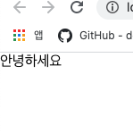

# 3. 나의 첫 번째 리액트 컴포넌트

첫 번째 리액트 컴포넌트를 만들자. 일단 리액트 컴포넌트란놈이 뭘까..

> Conceptually, components are like JavaScript functions. They accept arbitrary inputs (called “props”) and return React elements describing what should appear on the screen.

React 공식문서 "[Component and Props](https://reactjs.org/docs/components-and-props.html)" 참고

OKAY .. JavaScript 함수같은 놈들이군 ,,

---

- src 폴더 밑에 Hello.js라는 파일을 만들자

```
|-src
|  |-Hello.js
```

```javascript
import React from "react";

function Hello() {
  return <div> 안녕하세요 </div>;
}
export default Hello;
```

- 리액트 컴포넌트를 만들때

```javascript
import React from "react";
```

를 통하여 리액트를 불러와줘야 한다.

- 리액트 컴포넌트는 함수형태로 작성할 수도 있고 클래스 형태로 작성할 수도 있는데, 현재는 함수형으로 작성하는 방법만 알아본다.
- 리액트 컴포넌트에서 XML 형식의 값을 반환해줄 수 있는데 이를 JSX라고 한다.
- 코드의 최하단

```javascript
export default Hello;
```

위 코드는 Hello라는 컴포넌트를 내보내겠다는 의미이다. 이렇게 해주면 다른 컴포넌트에서 불러와서 사용해 줄 수 있다.
좀더 자세히는 **ES6의 모듈형식** 을 공부하자.
이제 Hello컴포넌트를 App.js 불러와서 사용해보자

- App.js

```javascript
import React from "react";
import Hello from "./Hello";

function App() {
  return (
    <div>
      <Hello />
    </div>
  );
}

export default App;
```

- 실행화면
  

- index.js 파일을 열어보자

```javascript
import React from "react";
import ReactDOM from "react-dom";
import "./index.css";
import App from "./App";
import reportWebVitals from "./reportWebVitals";
ReactDOM.render(
  <React.StrictMode>
    <App />
  </React.StrictMode>,
  document.getElementById("root")
);
// If you want to start measuring performance in your app, pass a function
// to log results (for example: reportWebVitals(console.log))
// or send to an analytics endpoint. Learn more: https:
//bit.ly/CRA-vitals
reportWebVitals();
```

- 여기서 ReactDOM.render의 역할은 브라우저에 있는 실제 DOM 내부에 리액트 컴포넌트를 랜더링하겠다는 것을 의미한다. id가 root인 DOM을 선택하고 있는데 이 DOM을 찾아보면

```
public
|   |-index.html
```

```javascript
<div id="root"></div>
```

- id가 root인 div태그가 index.html 파일에 있는것을 알 수 있다. 결국 리액트 컴포넌트가 랜더링 될 때에는 랜더링 된 결과물이 위 div 내부에 랜더링되는 것이다.
