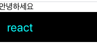
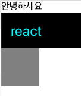

# 4. JSX의 기본 규칙 알아보기

- JSX는 리액트에서 생김새를 정의할 때, 사용하는 문법이다. HTML같이 생겼지만 JavaScript 이다.

```javascript
return <div>안녕하세요</div>;
```

- 리액트 컴포넌트 파일에서 XML 형태로 코드를 작성하게 되면 babel이 JSX를 JavaScript 로 변환을 해준다. 이 JSX가 JavaScript로 제대로 변환이 되려면 지켜주어야 하는 몇 가지 규칙이 있다.
- babel : JavaScript Compiler / Transpiler

## 1. 꼭 닫혀야 하는 태그

태그는 꼭 닫혀있어야 한다.

```javascript
import React from 'react';
import Hello from './Hello';

function App() {
	return (
		<div>
			<Hello />
			<div>
		</div>
	);
}
export default App;
```

위와 같이 div 태그가 안닫혀있으면 **오류**가 발생하게 된다.
또한 HTML에서 input 또는 br 태그를 사용할 때 닫지 않고 사용하는데 리액트에서는 그렇게 하면 안된다.

```javascript
import React from 'react';
import Hello from './Hello';

function App() {
	return (
		<div>
			<Hello />
			<input>     -><input />
			<br>        -><br />
		</div>
	);
}
export default App;
```

태그와 태그 사이에 내용이 들어가지 않을 때에는 **Self Closing** 태그 라는 것을 사용해야 한다. 현재 Hello 컴포넌트를 쓸때에도 **Self Closing** 태그를 사용 했다!

## 2. 꼭 감싸져야하는 태그

```javascript
import React from 'react';
import Hello from './Hello';

function App() {
	return (
		<Hello />
		<div>
			<Hello />
		</div>
	);
}
export default App;
```

두 개 이상의 태그는 무조건 하나의 태그로 감싸져있어야 한다. 위 코드는
Hello 컴포넌트를 호출하는 코드가 안감싸져있기 때문에 오류가 나며

```javascript
import React from "react";
import Hello from "./Hello";

function App() {
  return +(
    <div>
      <Hello />
      <div>
        <Hello />
      </div>+{" "}
    </div>
  );
}
export default App;
```

이렇게 단순히 감싸기 위해 불필요한 div로 감싸주는것은 별로 좋지 않다. 예를들어 스타일 관련 설정을 하다가 복잡해지게 되는 상황도 올 수 있고 table 관련 태그를 작성 할 때에도 내용을 div 같은걸로 감싸기엔 애매하다. 그럴땐 리액트의 **Fragement**라는 것을 사용하면 된다.

```javascript
import React from "react";
import Hello from "./Hello";

function App() {
  return (
    <>
      <Hello />
      <div> 하위 </div>
    </>
  );
}
export default App;
```

태그를 작성 할 때 이름 없이 작성하게 되면 **Fragement**가 만들어지는데 브라우저 상에서 따로 별도의 엘리먼트로 나타나지 않는다.

## 3. JSX 안에 자바스크립트 값 사용하기

JSX 내부에 자바스크립트 변수를 보여줘야 할 때에는 {}로 감싸서 보여준다

```javascript
import React from 'react';
import Hello from './Hello';

function App() {
	return (
	<>
		<Hello />
		<div>{name}</div>
	<>
	);
}
export default App;
```

## 4. style과 className

JSX에서 태그에 style과 CSS class를 설정하는 방법은 HTML에서 설정하는 방법과 다르다.
우선 인라인 스타일은 **객체 형태**로 작성해야하며, `background-color` 처럼 `-`로 구분되어 있는 이름들은 `backgroundColor` [camelCase](https://ko.wikipedia.org/wiki/%EB%82%99%ED%83%80_%EB%8C%80%EB%AC%B8%EC%9E%90) 형태로 네이밍해줘야 한다.

```javascript
import React from 'react';
import Hello from './Hello';

function App() {
	const name = "react";
	const style = {
		backgroundColor : "black",
		color: "aqua",
		fontsize : 24,
		padding : "1rem",
	};
	return (
	<>
		<Hello />
		<div style={style}>{name}</div>
	<>
	);
}
export default App;
```

- 실행화면
  

css class 를 설정할때에는 `class= ` 가 아닌 `classNmae= `으로 설정해주어야 한다

- **App.css**

```css
.gray-box {
  bacground: gray;
  width: 64px;
  height: 64px;
}
```

```javascript
import React from 'react';
import Hello from './Hello';

function App() {
	const name = "react";
	const style = {
		backgroundColor : "black",
		color: "aqua",
		fontsize : 24,
		padding : "1rem",
	};
	return (
	<>
		<Hello />
		<div style={style}>{name}</div>
		<div className="gray-box"></div>
	<>
	);
}
export default App;
```

- 실행화면
  

## 5. 주석

jSX에서 내부 주석은 `{/* 이런 형태로~ */}`작성된다.
열리는 태그 내부에서는

```javascript
<Hello
// 열리는 태그 내부에서 주석 활용
/>
```

이렇게 활용할 수도 있다.
