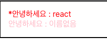

## 6. 조건부 렌더링

조건부 렌더링이란, 특정 조건에 따라 다른 결과물을 렌더링 하는 것을 의미한다.
예를 들어 App 컴포넌트에서 Hello 컴포넌트를 사용 할 때, isSpecial이라는 props를 설정한다면

- **App.js**

```javascript
import React from 'react';
import Hello from 'Hello';
import Wrapper from './Wrapper';

function App(){
	return (
	<Wrapper>
		<Hello name='react'
			   color='red'
			   isSpecial={true}
		/>
		<Hello color="pink">
	</Wrapper>
	);
}
export default App;
```

Hello 컴포넌트에서는 isSpecial이 true 이냐 false 이냐에 따라서 컴포넌트 좌측에 \* 표시를 보여주게 한다.
이를 처리하는 가장 기본적인 방법은 삼항연산자를 사용하는 것이다.

- **Hello.js**

```javascript
import React from 'react';

function Hello({color, name, isSpecial}){
	return (
		<div style={{ color }}>
			{isSpecial ? <b>*<b> : null} 안녕하세요 : {name}
		</div>
	);
}
Hello.defaultProps = {
	name : "이름없음",
};
export default Hello;
```

- 실행화면
  

보통 삼항연산자를 사용한 조건부 렌더링을 주로 특정 조건에 따라 보여줘야하는 내용이 다를 때 사용한다. 이런 상황에서는 &&(and)연산자를 사용해 처리하는게 더 편하다.

```javascript
{
  isSpecial && <b>*</b>;
}
안녕하세요: {
  name;
}
```

<br>
<br>

## props 값 설정을 생략하면 = {true}

말 그대로 값 설정을 생략하게 되면 true로 설정한 것으로 간주한다. 예로

- **App.js**

```javascript
import React from 'react';
import Hello from 'Hello';
import Wrapper from './Wrapper';

function App(){
	return (
	<Wrapper>
		<Hello name='react'
			   color='red'
			   isSpecial
		/>
		<Hello color="pink">
	</Wrapper>
	);
}
export default App;
```

위처럼 작성해도 코드는 똑같이 돌아간다.
