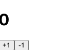

## 7. useState를 통해 바뀌는 값 관리하기

지금까지는 동적인 부분이 없었으나 이번에는 컴포넌트에서 보여줘야 하는 내용이 사용자 인터랙션에 따라 바뀌어야 할 때 어떻게 구현할 수 있는지에 대해서 알아본다.

- 리액트 16.8 이전 버전에서는 함수형 컴포넌트에서는 상태를 관리할 수 없었으나 리액트 16.8 에서 Hooks 라는 기능이 도입되면서 함수형 컴포넌트에서도 상태를 관리할 수 있게 되었다. 이번에 useState라는 함수를 사용하는데 이게 리액트의 Hooks 중 하나다.

버튼을 누르면 숫자가 바뀌는 Counter 컴포넌트를 만들자

```
|-src
|   |-Counter.js
|   |-App.js
```

- **Counter.js**

```javascript
import React from "react";

function Counter() {
  return (
    <div>
      <h1>0</h1>
      <button>+1</button>
      <button>-1</button>
    </div>
  );
}
export default Counter;
```

- **App.js**

```javascript
import React from "react";
import Counter from "./Counter";

function App() {
  return <Counter />;
}
```

- 실행화면
  

이런 UI 생성.
이제 Counter에서 버튼이 클릭되는 이벤트가 발생 했을 때, 특정 함수가 호출되도록 설정해보자.

- **Counter.js**

```javascript
import React from "react";

function Counter() {
  const onIncrease = () => {
    console.log("+1");
  };
  const onDecrease = () => {
    console.log("-1");
  };
  return (
    <div>
      <h1>0</h1>
      <button onClick={onIncrease}>+1</button>
      <button onClick={onDecrease}>-1</button>
    </div>
  );
}
export default Counter;
```

리액트 엘리먼트에서 설정해줄때에는 `on이벤트이름 = {실행하고싶은 함수}` 형태로 설정해주어야 한다.

> 여기서 주의해야 할 점은 함수 형태를 넣어주어야 하지 함수를 실행하면 안된다.!

1. `onClick={onIncrease()}` X
2. `onClick={onIncrease}` O
3. `onClick={ () => console.log('+1'); }` O

위의 3가지 방법 중 1번은 안되고 2, 3번은 실행이 된다. 1번은 렌더링 되는 시점에서 함수가 호출이 되기 때문이다. 이벤트를 설정할때에는 함수 타입의 **값** 을 넣어주어야 하고 자바스크립트에서는 함수 자체가 자료형이 될수 있기 때문에 2,3번이 함수 타입의 **값** 이 되며 실행이 된다.
<br>

## 동적인 값 끼얹기, useState

컴포넌트에서 동적인 값을 상태(state)라고 부른다. 리액트에 `useState` 라는 함수가 있는데 이것을 사용하면 컴포넌트에서 상태를 관리할 수 있다.

- **Counter.js**

```javascript
import React, { useState } from "react";

function Counter() {
  const [number, setNumber] = useState(0);
  const onIncrease = () => {
    setNumber(number + 1);
  };
  const onDecrease = () => {
    setNumber(number - 1);
  };
  return (
    <div>
      <h1>0</h1>
      <button onClick={onIncrease}>+1</button>
      <button onClick={onDecrease}>-1</button>
    </div>
  );
}
export default Counter;
```

- useState함수를 사용하기 위해서 import 해준다

```javascript
import React, { useState } from "react";
```

다음의 코드를 살펴보자

```javascript
const [number, setNumber] = useState(0);
```

- useState를 사용 할 때에는 상태의 기본값을 파라미터로 넣어서 호출해준다. `useState(0)` > 기본값 0
- 이 함수를 호출해주면 배열이 반환되는데 첫 번째 원소는 현재 상태, 두 번째 원소는 Setter함수이다.

원래 위의 코드는

```javascript
const numberState = useState(0); //함수의 기본값을 넣어 호출,numberState라는 배열 반환
const number = numberState[0]; // 첫 번째 원소 선언
const setnumber = numberState[1]; // 두 번째 setter 함수를 setnumber이라고 선언
```

3줄이며 배열 비구조화할당을 통해 각 원소를 추출해준 것이다.
Setter 함수는 파라미터로 전달 받은 값을 최신 상태로 설정해준다.
<br>

## 함수형 업데이트

지금 setter 함수를 사용할 때, 업데이트 하고 싶은 새로운 값을 파라미터로 넣어주고 있는데 그 대신에 기존 값을 어떻게 업데이트 할 지에 대한 함수를 등록하는 방식으로도 값을 업데이트 할 수 있다.

- **Counter.js**

```javascript
import React, { useState } from "react";

function Counter() {
  const [number, setNumber] = useState(0);
  const onIncrease = () => {
    setNumber((prevNumber) => prevNumber + 1);
  };
  const onDecrease = () => {
    setNumber((prevNumber) => prevNumber - 1);
  };
  return (
    <div>
      <h1>0</h1>
      <button onClick={onIncrease}>+1</button>
      <button onClick={onDecrease}>-1</button>
    </div>
  );
}
export default Counter;
```

값을 업데이트 하는 함수를 파라미터로 넣었는데 나중에 최적화 하게 될 때 사용된다.
