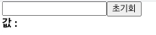

## 8. input 상태 관리하기

- 리액트에서 사용자가 입력 할 수 있는 input 태그의 상태를 관리하는 방법을 알아보자

```
|-src
|   |-InputSample.js
```

- **InputSample.js**

```javascript
import React from "react";

function InputSample() {
  return (
    <div>
      <input />
      <button>초기화</button>
      <div>
        <b>값 : </b>
      </div>
    </div>
  );
}
export default InputSample;
```

```javascript
import React from "react";
import InputSample from "./InputSample";

function App() {
  return <InputSample />;
}
export default App;
```

- 실행화면
  

- input 에 입력하는 값이 하단에 나타나게 하고, 초기화 버튼을 누르면 input 값이 비워지도록 구현해보자
- **InputSample.js**

```javascript
import React, {ustState} from 'react';

function InputSample(){
	const [text, setText] = useState("");
	const onChange = (e) => {
		setText(e.target.value)'
	};
	const onReset = () => {
		setText("");
	};
	return(
		<div>
			<input onChange={onChange} value={text}/>
			<button onClick={onReset}>초기화</button>
			<div>
				<b>값 : {text}</b>
			</div>
		</div>
	);
}
export default InputSample;
```

- input창에 글을 입력하면 onChange가 글이 입력혹은 수정될때마다 onChange함수를 실행한다.
- onChange라는 이벤트 함수에서는 이벤트 객체 e(event)를 파라미터로 받아와서 사용할 수 있는데 이 객체의 e.target은 이벤트가 발생한 DOM인 input DOM을 가리키게 되며 위 코드에서 `e.target.value`는 input의 value 값을 가리키게 된다.
- onChange 함수 안에 setText함수를 사용해 `{text}`의 값을 `input.value`의 값으로 변경시켜준다.
