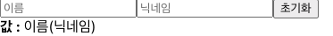

## 9. 여러개의 input 상태 관리하기

여러개의 input 상태를 관리해보자 -**InputSample.js**

```javascript
import React, {useState} from 'react';

function InputSample() {
	const onChange = (e) => {
	};
	const onReset = (e) => {
	};
	return (
		<div>
			<input placeholder="이름">
			<input placeholder="닉네임/>
			<button onClick={onReset}>초기화</button>
			<div>
				<b> 값:</b>
				이름(닉네임)
			</div>
		</div>
	);
}
export default InputSample;
```

- 다시 초기화 시키고 input창을 2개로 늘렸으며 placeholder를 추가했다.
- 실행화면
  
- input 의 개수가 여러개가 됐을 때는 단순히 useState를 여러번 사용하고 onChange도 여러개 만들어서 구현 할 수 있지만 좋은 방법은 아니다.
- 더 좋은 방법은 input에 name을 설정하고 이벤트가 발생 했을 때 이 값을 참조하는 방법이다. 그리고 useState 에서는 문자열이 아니라 객체 형태의 상태를 관리해주어야 한다. -**InputSample.js**

```javascript
import React, { useState } from "react";

function InputSample() {
  const [inputs, setInputs] = useState({
    name: "",
    nickname: "",
  });

  const { name, nickname } = inputs; //비구조화 할당을 통해 값 추출
  const onChange = (e) => {
    const { value, name } = e.target; // 우선 e.target에서 name과 value를 추출
    setInputs({
      ...inputs, //기존의 input를 복사하고
      [name]: value, // name 키를 가진 value값을 준다
    });
  };
  const onReset = (e) => {
    setInputs({
      name: "",
      nickname: "",
    });
  };
  return (
    <div>
      <input name="name" placeholder="이름" onChagne={onChange} value={name} />
      <input
        nickname="nickname"
        placeholder="닉네임"
        onChange={onChange}
        value={nickname}
      />
      <button onClick={onReset}>초기화</button>
      <div>
        <b> 값:</b>
        {name} ({nickname})
      </div>
    </div>
  );
}
export default InputSample;
```

- 리액트 상태에서 객체를 수정해애 할 때에는 `inputs[name] = value` 이런 식으로 직접 수정하면 안된다.
- 새로운 객체를 만들어서 새로운 객체에 변화를 주고 이를 상태로 사용해주어야 한다.

```javascript
setInputs({
  ...inputs,
  [name]: value,
});
```

여기서 ... 은 spread 문법이다. 객체의 내용을 모두 펼쳐서 기존 객체를 복사해준다.

- 이러한 작업을 불변성을 지킨다 라고 부르며 불변성을 지켜주어야만 리액트 컴포넌트에서 상태가 업데이트 됐음을 감지 할 수 있고 이에 따라 필요한 리렌더링이 진행된다. 기존 상태를 직접 수정하게 되면 값을 바꿔도 리렌더링이 되지 않는다.
