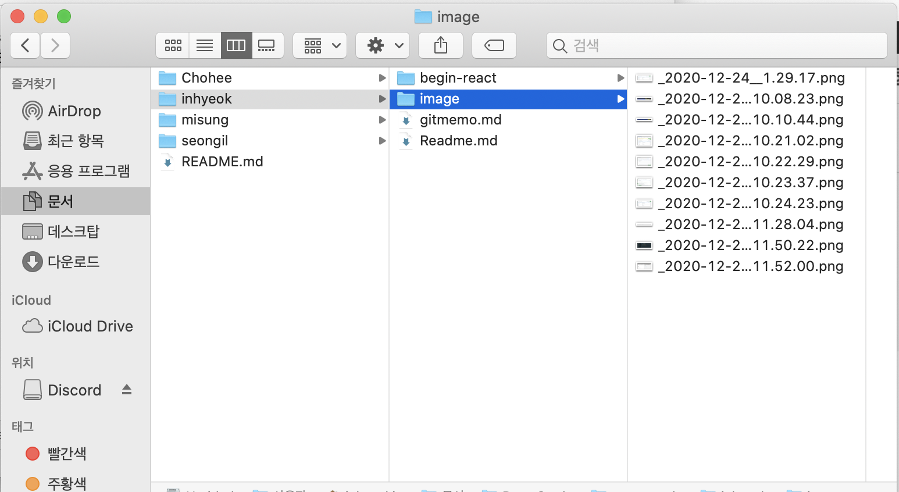

# 스터디하면서 git, github 이용

git 설치돼있고 github 계정이 있는 상태

저희 공유 레포 url입니다

[https://github.com/EndlessCreation/react_study](https://github.com/EndlessCreation/react_study)

# #step1 공유 리포지토리에 올리기

### folder 선택


이전 사람들은 각자 자기 폴더 이름 만들고 업로드 하고 있다. 충돌 방지 때문인듯

~~나도 폴더를 만들고 거기에 올려주자. 나머지 친구들 폴더를 다운받고싶지 않아서 clone를 안하고 그냥 폴더만 만들어서 remote를 해보자~~

2시간의 삽질 끝에 클론 결정.!^^ (시간의 흐름이 느껴진다)

## clone

내 폴더로 갑시다

```jsx
git clone https://github.com/EndlessCreation/react_stduy
```

git remote를 해보면 origin이 자동으로 추가돼있는것을 확인할 수 있음.

## new branch

folder가 다르기때문에 충돌이 날 위험은 없지만 branch를 만들고 PR을 하는 습관을 배우기 위해 branch를 만들어봅니다.

```jsx
git branch inhyeok    //branch생성
git checkout inhyeok  //HEAD main > inhyeok 브랜치 이동
```

my folder

이후 내 폴더를 만들고 예전에 작업했던 폴더를 inhyeok 폴더 안에 넣어줍시다.

```jsx
mkdir inhyeok
```


보면 갑자기 branch가 master로변경됐다.

예전에 작업했던 파일에 .git파일이 존재하는데 아마 create-react-app을 하면서 git init이 자동으로 실행됐기 때문이다. git 충돌을 발생하기위해 이 필요없는 .git 파일을 삭제해주자.


하위 디렉토리에서 .git 파일이 삭제되니깐 자동으로 상위 .git branch이 적용된 모습.. 편안,,

## git add & commit

내 파일들을 commit해보자

```jsx
git add.
git commit -m "2020/12/24 init inhyeok folder"
```

git 쓰기전엔 몰랐는데 commit message 형식을 통일시켜야 할거같다..

이후 원격 저장소에 push 해주자

## git push

```jsx
git push origin inhyeok
```


내 이름의 branch가 생성된걸 보임.

이제 중간에 compare & pull request를 눌러 main과 merge를 해주자


Able to merge.. kia;;

사실 PR의 기능은 잘ㄹ모른다.. 초밥킴 강의점


Merge pull request..


Main branch

# #step2 수정하기

이 글을 작성하는 도중에 스터디원이 커밋을 해버렸다..


24minutes ago..

- 희초김?처럼 내 inhyeok 폴더에 필기한 내용을 업로드할 예정이라 일단 첫번째로 [Readme.md](http://readme.md) 파일을 만들어서 올려보자.
- 이 필기 내용도 마크다운으로 변환시켜 깃에 업로드 해보자. 단 최초 업로드 이후 계속 수정하기가 힘들것같으니 업데이트 주기는 step이 완료될때마다 업데이트하자..

### 1. Readme.md파일 생성


[stackEdit](https://stackedit.io/app#) 사이트를 확인하면 실시간으로 마크다운 파일을 변환해준다.


### 2. Notion에서 필기 내용 마크다운 변환

- 노션에서 주로 필기하기 때문에 노션페이지를 마크다운형식으로 변환해줍시다.
- 페이지에서 오른쪽 상단 ... 을 누르면 내보내기가 있다 여기서 마크다운으로 변환하기 눌러서 저장해준다.


- md 파일과 img가 담겨있는 폴더를 준다.



- md파일 이름을 [gitmemo.md](http://gitmemo.md)로 변경해주고 이제 image 폴더를 만들어서 새로 작업해주자(이거 step2 하고 다시 해야하는건 안비밀;)

  

  사진들 링크 충격 그 자체;

- 희초김이 slack에다가 야매로 올리는법을 알려줬는데 잘 모르니깐 원래 방식대로 해보겠습니다.

  

  이렇게 링크의 url을 image폴더 만든것을 반영해서 수정하고 저장

### 3. push

```jsx
git add .
git commit -m "2020/12/25 md file update_v2"
```

Merry Christmass..

커밋을 해주고

step 1의 작업을 반복하면 완료.
