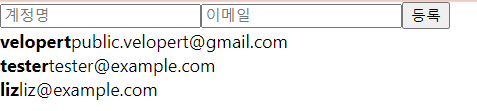
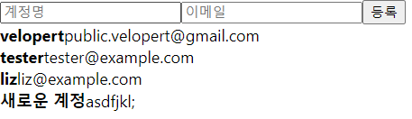

# 13. 배열에 항목 추가

## 준비과정

1. input 2개, button 1개로 이루어진 CreateUser.js 라는 컴포넌트 만들어주기

**CreateUser.js**

```jsx
import React from 'react';

function CreateUser({username, email, onChange, onCreate}) {
    return (
    <div>
        <input
            name="username"
            placeholder = "계정명"
            onChange = {onChange}
            value = {username}
        />
        <input
            name = "email"
            placeholder = "이메일"
            onChange = {onChange}
            value = {email}
        />
        <button onCilck = {onCreate}>등록</button>
    </div>
    )
}

export default CreateUser;
```

상태관리를 CreateUser에서 하지 않고 부모 컴포넌트인 App 에서 하게 하고, input의 값 및 이벤트로 등록할 함수들을 props로 넘겨받아서 사용해주겠다!

2. 이 컴포넌트를 App 에서 UserList 위에 렌더링해보기

**App.js**

```jsx
return (
    <>
    **<CreateUser />**
    <UserList users={users}/>
    </>
  )
```



3. CreateUser 컴포넌트에 필요한 props를 App에서 준비해두기

**App.js**

```jsx
import React, { useRef, useState } from 'react';
import UserList from './UserList';
import CreateUser from './CreateUser';

function App() {
  const [inputs, setInputs] = useState({
    username: '',
    email: ''
  });
  const { username, email } = inputs;
  const onChange = e => {
    const { name, value } = e.target;
    setInputs({
      ...inputs,
      [name]: value
    });
  };
  const users = [
    {
      id: 1,
      username: 'velopert',
      email: 'public.velopert@gmail.com'
    },
    {
      id: 2,
      username: 'tester',
      email: 'tester@example.com'
    },
    {
      id: 3,
      username: 'liz',
      email: 'liz@example.com'
    }
  ];

  const nextId = useRef(4);
  const onCreate = () => {
    // 나중에 구현 할 배열에 항목 추가하는 로직
    // ...

    setInputs({
      username: '',
      email: ''
    });
    nextId.current += 1;
  };
  return (
    <>
      <CreateUser
        username={username}
        email={email}
        onChange={onChange}
        onCreate={onCreate}
      />
      <UserList users={users} />
    </>
  );
}

export default App;
```

→ 등록 눌렀을 때 input 값들이 초기화

4. users 배열도  useState를 사용하여 컴포넌트의 상태로서 관리해주기

등록할 시에 배열이 바뀌어야 해서

**App.js**

```jsx
const [users, setUsers] = useState([
    {
      id: 1,
      username: 'velopert',
      email: 'public.velopert@gmail.com'
    },
    {
      id: 2,
      username: 'tester',
      email: 'tester@example.com'
    },
    {
      id: 3,
      username: 'liz',
      email: 'liz@example.com'
    }
  ]);
```

---

## 배열에 변화 주기 (새 항목 추가)

객체와 마찬가지로 변화를 줄 때는 **불변성**을 지켜주어야 한다!

그렇기 때문에 배열의 push, splice, sort 등의 함수를 사용하면 안됨!

불변성을 지키면서 배열에 새 항목을 추가하는 방법은 두가지

### Spread 연산자 사용

**App.js**

```jsx
const onCreate = () => {
    // 나중에 구현 할 배열에 항목 추가하는 로직
    // ...

    **const user = {
      id : nextId.current,
      username,
      email
    }
    setUsers ([...users, user]);**
    setInputs({
      username: '',
      email: ''
    });
    nextId.current += 1;
  };
```



### concat 함수 사용

concat 함수 : 기존의 배열을 수정하지 않고, 새로운 원소가 추가된 새 배열을 만들어준다.

**App.js**

```jsx
const onCreate = () => {
    // 나중에 구현 할 배열에 항목 추가하는 로직
    // ...

    const user = {
      id : nextId.current,
      username,
      email
    }
    **setUsers (users.concat(user));**
    setInputs({
      username: '',
      email: ''
    });
    nextId.current += 1;
  };
```

spread 연산자나 concat 을 사용하면 새항목 추가 가능!