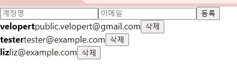

# 14. 배열에 항목 제거

### 준비

UserList에서 User 컴포넌트를 보여줄 때, 삭제 버튼을 렌더링 해주기

**UserList.js**

```jsx
import React from 'react';

function User({user, onRemove}) {
  return (
    <div>
      <b>{user.username}</b><span>{(user.email)}</span>
      **<button onClick={()=>onRemove(user.id)}>삭제</button>**
    </div>
  )
}

function UserList ({users, onRemove}) {

  return (
    <div>
      {users.map(user => (
        <User user={user} key={user.id} onRemove={onRemove}/> 
      ))}
    </div>
  )
}

export default UserList;
```



→ User 컴포넌트의 삭제 버튼이 클릭 될 때는 [user.id](http://user.id) 값을 앞으로 받아올 onRemove 함수의 파라미터로 넣어서 호출 해 주어야 함.

→ onRemove **"id가 _인 객체를 삭제해라"** 역할!

→ 이 onRemove 함수는 UserList에서도 전달 받을 것이며, 이를 그대로 User 컴포넌트에게 전달해줄것.

## onRemove 함수 구현

- 추가할 때와 마찬가지로 불변성을 지켜가면서 업데이트를 해주어야 함.
- **불변성을 지키면서** 특정 원소를 배열에서 제거하기 위해서는 filter 배열 내장 함수를 사용하는 것이 가장 편함.
- **filter 함수 : 배열에서 특정 조건이 만족되는 원소들만 추출하여 새로운 배열을 만들어줌.**

App 컴포넌트에서 onRemove 를 다음과 같이 구현 후, UserList에 전달해주기

**App.js**

```jsx
const onRemove = id => {
    //user.id 가 파라미터로 일치하지 않는 원소만 추출해서 새로운 배열을 만듦.
    //= user.id가 id 인 것을 삭제함.
    setUsers(users.filter(user => user.id !== id));
  }

  return (
    <>
      <CreateUser
        username={username}
        email={email}
        onChange={onChange}
        onCreate={onCreate}
      />
      <UserList users={users} onRemove={onRemove}/>
    </>
  );
}
```