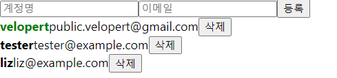
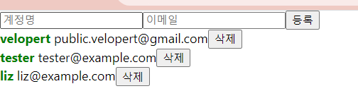

# 15. 배열에 항목 수정

active 값에 따라 폰트의 색상이 바뀌고 cursor 필드를 설정하여 마우스를 올렸을 때 커서가 손가락 모양으로 변하도록 해보기

**App.js** (users 배열 안의 객체 안에 active 라는 속성 추가!

```jsx
import React, { useRef, useState } from 'react';
import UserList from './UserList';
import CreateUser from './CreateUser';

function App() {
  const [inputs, setInputs] = useState({
    username: '',
    email: ''
  });
  const { username, email } = inputs;
  const onChange = e => {
    const { name, value } = e.target;
    setInputs({
      ...inputs,
      [name]: value
    });
  };
  const [users, setUsers] = useState([
    {
      id: 1,
      username: 'velopert',
      email: 'public.velopert@gmail.com',
      active : true
    },
    {
      id: 2,
      username: 'tester',
      email: 'tester@example.com',
      active : false
    },
    {
      id: 3,
      username: 'liz',
      email: 'liz@example.com',
      active : false
    }
  ]);

  const nextId = useRef(4);
  const onCreate = () => {
    // 나중에 구현 할 배열에 항목 추가하는 로직
    // ...

    const user = {
      id : nextId.current,
      username,
      email
    }
    setUsers (users.concat(user));
    setInputs({
      username: '',
      email: ''
    });
    nextId.current += 1;
  };

  const onRemove = id => {
    //user.id 가 파라미터로 일치하지 않는 원소만 추출해서 새로운 배열을 만듦.
    //= user.id가 id 인 것을 삭제함.
    setUsers(users.filter(user => user.id !== id));
  }

  return (
    <>
      <CreateUser
        username={username}
        email={email}
        onChange={onChange}
        onCreate={onCreate}
      />
      <UserList users={users} onRemove={onRemove} />
    </>
  );
}

export default App;
```

**UserList.js**

```jsx
import React from 'react';

function User({user, onRemove}) {
  return (
    <div>
      **<b
        style={{
          cursor : 'pointer',
          color : user.active ? 'green' : 'black'
        }}
      >**{user.username}</b><span>{(user.email)}</span>
      <button onClick={()=>onRemove(user.id)}>삭제</button>
    </div>
  )
}

function UserList ({users, onRemove}) {

  return (
    <div>
      {users.map(user => (
        <User user={user} key={user.id} onRemove={onRemove}/> 
      ))}
    </div>
  )
}

export default UserList;
```



---

## App.js 에서 onToggle 함수 구현

- 배열의 불변성을 유지하면서 배열을 업데이트 할 때에도 **map 함수**를 사용할 수 있다.
- **id 값을 비교 → 다르면 그대로, 같으면 active 값 반전!**

onToggle 함수를 만들어서 UserList 컴포넌트에게 전달

**App.js**

```jsx
const onToggle = id => {
    setUsers(
      users.map(user =>
        user.id === id ? {...user, active : !user.active} : user)
    )
  }
  return (
    <>
      <CreateUser
        username={username}
        email={email}
        onChange={onChange}
        onCreate={onCreate}
      />
      <UserList users={users} onRemove={onRemove} onToggle={onToggle}/>
    </>
  );
```

그 다음 UserList 컴포넌트에서 onToggle을 받아와서 User 에게 전달 해주고, onRemove를 구현했던 것처럼 onToggle에 id 를 넣어서 호출해주기

**UserList.js**

```jsx
import React from 'react';

function User({user, onRemove, onToggle}) {
  return (
    <div>
      <b
        style={{
          cursor : 'pointer',
          color : user.active ? 'green' : 'black'
        }}
        onClick={()=>onToggle(user.id)}
      >
        {user.username}</b>
      &nbsp;
      <span>{(user.email)}</span>
      <button onClick={()=>onRemove(user.id)}>삭제</button>
    </div>
  )
}

function UserList ({users, onRemove, onToggle}) {

  return (
    <div>
      {users.map(user => (
        <User user={user} key={user.id} onRemove={onRemove} onToggle={onToggle}/> 
      ))}
    </div>
  )
}

export default UserList
```



→ 이름을 클릭하면 색이 바뀜