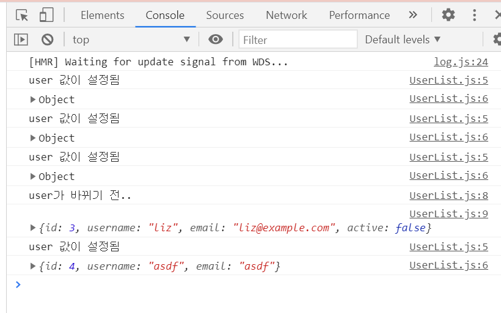
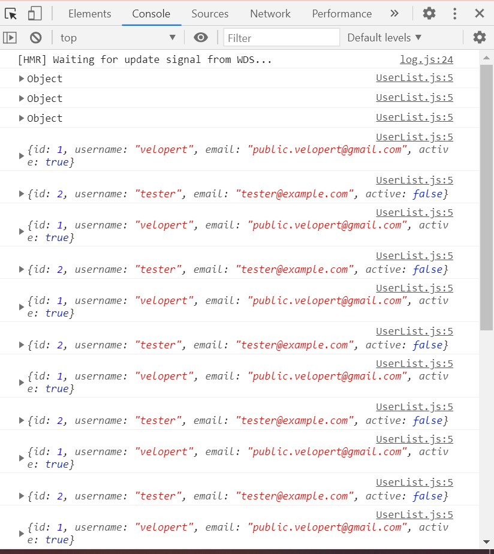

# 16. useEffect를 사용하여 마운트/언마운트/업데이트시 할 작업 설정

**useEffect라는 Hook을 사용하여 컴포넌트가 마운트 됐을 때 (처음 나타났을 때), 언마운트 됐을 때 (사라질 때), 그리고 업데이트 될 때 (특정 props가 바뀔 때) 특정 작업을 처리하는 방법 알아보기**

## 마운트 / 언마운트

**UserList.js**

```jsx
import React, {useEffect} from 'react';

function User({user, onRemove, onToggle}) {
  useEffect (()=> {
    console.log('컴포넌트가 화면에 나타남');
    return () => {
      console.log('컴포넌트가 화면에서 사라짐');
    };
  },[])

// 컴포넌트가 화면에 나타남 (맨 처음)
// 컴포넌트가 화면에서 사라짐 (항목을 삭제했을 경우)
// 컴포넌트가 화면에 나타남 (항목을 추가했을 경우)
```

**useEffect를 사용할 때**

- 첫번째 파라미터 : 함수, 두번째 파라미터 : 의존값이 들어있는 배열 ( deps )
- **deps 배열을 비우게 된다면, 컴포넌트가 처음 나타날때에만 useEffect에 등록한 함수가 호출**

**useEffect 는 함수를 반환할 수 있다.**

- 이를 **cleanup 함수**라고 부름
- cleanup함수는 useEffect에 대한 뒷정리를 해준다고 이해하기
- **deps가 비어있는 경우에는 컴포넌트가 사라질 때 cleanup 함수가 호출된다.**

주로 마운트 시에 하는 작업들

- props로 받은 값을 컴포넌트의 로컬 상태로 설정
- 외부 API 요청 (REST API 등)
- 라이브러리 사용(D3, Video.js 등)
- setInterval 을 통한 반복작업 혹은 setTimeout을 통한 작업 예약

주로 언마운트 시에 하는 작업들

- setInterval, setTimeout 을 사용하여 등록한 작업들 clear 하기 (clearInterval, clearTimeout)
- 라이브러리 인스턴스 제거

---

## deps 에 특정 값 넣기

- deps에 특정 값을 넣게 되면, 컴포넌트가 처음 마운트 될 때에도 호출, 지정한 값이 바뀔 때에도 호출됨
- deps 안에 특정 값이 있다면 언마운트 시에도 호출, 값이 바뀌기 직전에도 호출

**UserList.js**

```jsx
import React, {useEffect} from 'react';

function User({user, onRemove, onToggle}) {
  useEffect (()=> {
    console.log('user 값이 설정됨');
    console.log(user);
    return () => {
      console.log('user가 바뀌기 전..');
      console.log(user);
    };
  },[user])
```



useEffect 안에서 사용하는 상태나, props 가 있다면 useEffect 의 deps에 넣어주는게 규칙!

만약 이 규칙을 따르지 않는다면 useEffect 에 등록한 함수가 실행 될 때 최신 props / 상태를 가르키지 않게 된다.

## deps 파라미터를 생략하기

생략하면 컴포넌트가 리렌더링 될 때마다 호출 된다.

```jsx
import React, {useEffect} from 'react';

function User({user, onRemove, onToggle}) {
  useEffect (()=> {
    console.log(user);
  })
```



**리액트 컴포넌트는 기본적으로 부모컴포넌트가 리렌더링되면 자식 컴포넌트 또한 리렌더링** (바뀐내용이 없다 할지라도)

물론, 실제 DOM에 변화가 반영되는 것은 바뀐 내용이 있는 컴포넌트에만 해당. 하지만 Virtual DOM에는 모든 걸 다 렌더링 하고 있다는 것이다.

나중에는 컴포넌트를 최적화하는 과정에서 기존의 내용을 그대로 사용하면서 Virtual DOM에 렌더링 하는 리소스를 아낄 수 있다 (다음에 알아볼 것임)