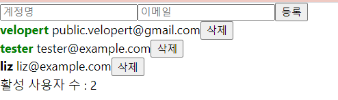

# 17. useMemo를 사용하여 연산한 값 재사용하기

성능 최적화를 위하여 연산된 값을 useMemo라는 Hook을 사용하여 재사용하는 방법을 알아보자!

App 컴포넌트에서 countActiveUsers 함수를 만들어서, active 값이 true 인 사용자의 수를 세어서 화면에 렌더링 해보기

App.js

```jsx
import React, { useRef, useState } from 'react';
import UserList from './UserList';
import CreateUser from './CreateUser';

function App() {
  const [inputs, setInputs] = useState({
    username: '',
    email: ''
  });

  const { username, email } = inputs;
  const onChange = e => {
    const { name, value } = e.target;
    setInputs({
      ...inputs,
      [name]: value
    });
  };

  function countActiveUsers (users) {
    console.log("활성 사용자 수 세는중 ,,");
    return users.filter(user => user.active).length;
  }
  const [users, setUsers] = useState([
    {
      id: 1,
      username: 'velopert',
      email: 'public.velopert@gmail.com',
      active : true
    },
    {
      id: 2,
      username: 'tester',
      email: 'tester@example.com',
      active : false
    },
    {
      id: 3,
      username: 'liz',
      email: 'liz@example.com',
      active : false
    }
  ]);

  const nextId = useRef(4);
  const onCreate = () => {
    // 나중에 구현 할 배열에 항목 추가하는 로직
    // ...

    const user = {
      id : nextId.current,
      username,
      email
    }
    setUsers (users.concat(user));
    setInputs({
      username: '',
      email: ''
    });
    nextId.current += 1;
  };

  const onRemove = id => {
    //user.id 가 파라미터로 일치하지 않는 원소만 추출해서 새로운 배열을 만듦.
    //= user.id가 id 인 것을 삭제함.
    setUsers(users.filter(user => user.id !== id));
  }

  const onToggle = id => {
    setUsers(
      users.map(user =>
        user.id === id ? {...user, active : !user.active} : user)
    )
  }
  const count = countActiveUsers(users);
  return (
    <>
      <CreateUser
        username={username}
        email={email}
        onChange={onChange}
        onCreate={onCreate}
      />
      <UserList users={users} onRemove={onRemove} onToggle={onToggle}/>
      <div>활성 사용자 수 : {count} </div>
    </>
  );
}

export default App;
```



→ 사람의 이름을 클릭해 활성 시켜도 활성 사용자 수가 잘 늘어난다!

→ 하지만 input의 값을 바꿀 때 countActive 함수가 호출되어 input 값이 바뀔 때도 컴포넌트가 리렌더링 되므로 불필요하게 호출되어 자원이 낭비 된다..

(memorize는 이전에 계산 한 값을 재사용한다는 의미를 가지고 있다.)

## useMemo 사용하여 성능 최적화!

이러한 상황에 **useMemo**라는 Hook 함수를 사용하면 성능을 최적화 시킬 수 있음!!

(memorize는 이전에 계산 한 값을 재사용한다는 의미를 가지고 있다.

**App.js**

```jsx
import React, { useRef, useState, useMemo } from 'react';
import UserList from './UserList';
import CreateUser from './CreateUser';

function countActiveUsers(users) {
  console.log('활성 사용자 수를 세는중...');
  return users.filter(user => user.active).length;
}

function App() {
  const [inputs, setInputs] = useState({
    username: '',
    email: ''
  });
  const { username, email } = inputs;
  const onChange = e => {
    const { name, value } = e.target;
    setInputs({
      ...inputs,
      [name]: value
    });
  };
  const [users, setUsers] = useState([
    {
      id: 1,
      username: 'velopert',
      email: 'public.velopert@gmail.com',
      active: true
    },
    {
      id: 2,
      username: 'tester',
      email: 'tester@example.com',
      active: false
    },
    {
      id: 3,
      username: 'liz',
      email: 'liz@example.com',
      active: false
    }
  ]);

  const nextId = useRef(4);
  const onCreate = () => {
    const user = {
      id: nextId.current,
      username,
      email
    };
    setUsers(users.concat(user));

    setInputs({
      username: '',
      email: ''
    });
    nextId.current += 1;
  };

  const onRemove = id => {
    // user.id 가 파라미터로 일치하지 않는 원소만 추출해서 새로운 배열을 만듬
    // = user.id 가 id 인 것을 제거함
    setUsers(users.filter(user => user.id !== id));
  };
  const onToggle = id => {
    setUsers(
      users.map(user =>
        user.id === id ? { ...user, active: !user.active } : user
      )
    );
  };
  const count = useMemo(() => countActiveUsers(users), [users]);
  return (
    <>
      <CreateUser
        username={username}
        email={email}
        onChange={onChange}
        onCreate={onCreate}
      />
      <UserList users={users} onRemove={onRemove} onToggle={onToggle} />
      <div>활성사용자 수 : {count}</div>
    </>
  );
}

export default App;
```