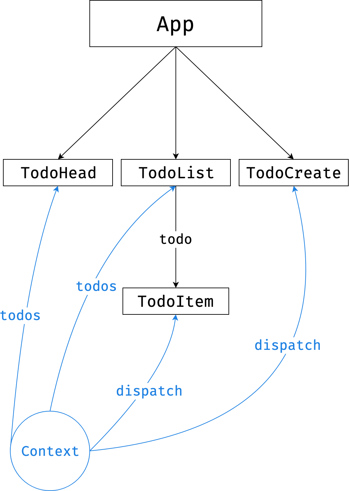
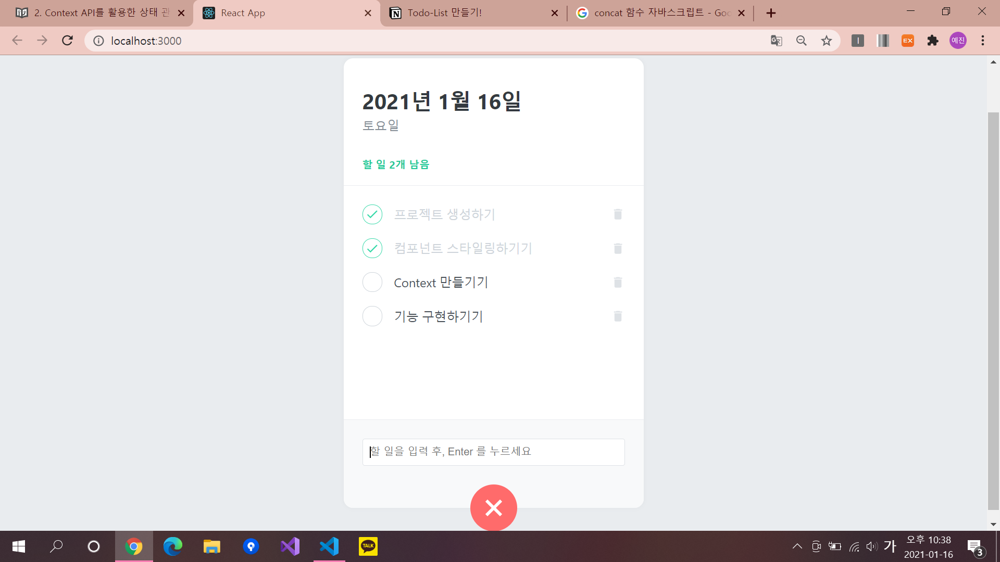

# Todo-List 만들기!

## 컴포넌트 설명

- **TodoTemplete** : 투두리스트 레이아웃 ( 흰색 박스 )
- **TodoHead** : 투두리스트 위에 나타나는 오늘 날짜, 요일, 남은 일이 적혀있음
- **TodoList** : 여러개의 TodoItem 컴포넌트를 렌더링하여 만들어진 해야할 목록
- **TodoItem** : 각 할일에 대한 정보로 TodoList에서 렌더링 됨
- **TodoCreate** : 새로운 할 일을 등록
- **TodoContext** : 다른 컴포넌트에서 바로 사용할 수 있는 dispatch와 state, nextId..
- **TodoProvider** : 만든 Hook을 사용하기 위해 해당 컴포넌트들은 TodoProvider컴포넌트 내부에 렌더링 되어있어야함 → App에서 TodoProvider로 감싸주어야함. (import { TodoProvider } from './TodoContext';) 선언!

## Context API를 활용한 상태관리

- 이 투두리스트에서는 Context API를 활용한 상태관리를 할 것이다.



→ 이런느낌~

---

## 👩‍💻 코드 작성~!

### 1️⃣ App.js

```jsx
import React from 'react';
import {createGlobalStyle} from 'styled-components';
import TodoTemplate from './components/TodoTemplate';
import TodoHead from './components/TodoHead';
import TodoList from './components/TodoList';
import TodoCreate from './components/TodoCreate';
import {TodoProvider} from './TodoContext';

const GlobalSytle = createGlobalStyle`
  body {
    background : #e9ecef;
  }
`;

function App() {
  return (
    <TodoProvider>
      <GlobalSytle />
      <TodoTemplate>
        <TodoHead />
        <TodoList />
        <TodoCreate />
      </TodoTemplate>
    </TodoProvider>
  )
}

export default App;
```

### 2️⃣ TodoTemplate.js

```jsx
import React from 'react';
import styled from 'styled-components';

const TodoTemplateBlock = styled.div`
    width: 512px;
    height: 768px;

    position: relative; /* 추후 박스 하단에 추가 버튼을 위치시키기 위한 설정 */
    background: white;
    border-radius: 16px; //테두리를 둥글게 만들기 위한 속성
    box-shadow: 0 0 8px 0 rgba(0, 0, 0, 0.04); //박스 그림자

    margin: 0 auto; /* 페이지가 중앙에 나타나도록 설정 = 중앙정렬 */

    margin-top: 96px;
    margin-bottom: 32px;
    display: flex; /* flex 레이아웃 설정을 위한 기본 속성 */
    flex-direction: column; /* 아이템들이 각각 한줄을 차지하며 block 처럼 위에서 아래로 배치 */
`;

/* 태그 사이에 있는 값을 받아오기 위해 children을 props로 사용 (비구조화 할당) */
function TodoTemplate({children}) {
    return <TodoTemplateBlock>{children}</TodoTemplateBlock>
}

export default TodoTemplate;
```

### 3️⃣ TodoContext.js

```jsx
import React,{useReducer, createContext, useContext, useRef} from 'react';

//Todos 항목들
const initialTodos=[
    {
        id: 1,
        text: '프로젝트 생성하기',
        done: true 
    },
    {
        id: 2,
        text: '컴포넌트 스타일링하기기',
        done: true 
    },
    {
        id: 3,
        text: 'Context 만들기기',
        done: false 
    },
    {
        id: 4,
        text: '기능 구현하기기',
        done: false 
    }
];

//Reducer 함수 만들기
function todoReducer(state, action) {
    switch(action.type){
				//새로운 항목을 만들 경우 (기존 배열에 합치는 concat 함수)
        case 'CREATE':
            return state.concat(action.todo);
				//항목을 클릭할 경우 (새로운 배열을 만들어 내는는 map 함수)
        case 'TOGGLE':
            return state.map(todo =>
                todo.id === action.id ? {...todo, done: !todo.done} : todo);
				//항목을 제거할 경우 (조건에 맞는 요소로 배열을 만드는 filter 함수)
        case 'REMOVE':
            return state.filter(todo=> todo.id !==action.id);
        default:
            throw new Error(`Unhandled action type: ${action.type}`)
    }
}

//Context 만들기 (state와 dispatch 따로! -> 불필요한 렌더링을 막기 위해)
const TodoStateContext = createContext();   //state를 위한 context
const TodoDispatchContext = createContext();    //dispatch를 위한 context
const TodoNextIdContext = createContext();      //nextId 값을 위한 Context (nextId = 새로운 항목을 추가할 때 사용하는 고유 ID)

export function TodoProvider({children}) {
    const [state, dispatch] = useReducer(todoReducer, initialTodos);
    const nextId = useRef(5);

    //Provider 컴포넌트를 렌더링해주고 value를 설정,
    //props로 받아온 children값을 내부에 렌더링
    return (
        <TodoStateContext.Provider value={state}>
            <TodoDispatchContext.Provider value={dispatch}>
                <TodoNextIdContext.Provider value={nextId}>
                {children}  
                </TodoNextIdContext.Provider>
            </TodoDispatchContext.Provider>
        </TodoStateContext.Provider>
    )
}

/* useContext를 사용하는 **커스텀 Hooks**를 만들어서 내보내줌 */
/* 사용하기 편하게! */
/* 나중에 const state = useTodoState(); 이런식으로 사용가능 */
export function useTodoState() {
    return useContext(TodoStateContext);
}

export function useTodoDispatch() {
    return useContext(TodoDispatchContext);
}

export function useTodoNextId() {
    return useContext(TodoNextIdContext);
}
```

### 4️⃣ TodoProvider.js

```jsx
/* useTodoState, useTodoDispatch, useTodoNextId(=커스텀 Hooks)를 사용하려면 TodoProvider 컴포넌트 내부에 렌더링되어 있어야 함*/
/* App.js 에서 **import {TodoProvider} from './TodoContext';** 이렇게 선언해야함! */
import React,{useReducer, createContext, useContext, useRef} from 'react';

const initialTodos = [
    {
        id: 1,
        text: '프로젝트 생성하기',
        done: true 
    },
    {
        id: 2,
        text: '컴포넌트 스타일링하기기',
        done: true 
    },
    {
        id: 3,
        text: 'Context 만들기기',
        done: false 
    },
    {
        id: 4,
        text: '기능 구현하기기',
        done: true 
    }
];

function todoReducer(state, action){
    switch(action.type){
        case 'CREATE':
            return state.concat(action.todo);
        case 'TOGGLE':
            return state.map(todo =>
                todo.id === action.id ? {...todo, done: !todo.done} : todo);
        case 'REMOVE':
            return state.filter(todo=> todo.id !==action.id);
        default:
            throw new Error(`Unhandled action type: ${action.type}`);
    }
}

const TodoStateContext = createContext();
const TodoDispatchContext = createContext();
const TodoNextIdContext = createContext();

export function TodoProvider({children}){
    const [state, dispatch] = useReducer(todoReducer,initialTodos);
    const nextId = useRef(5);

    return(
        <TodoStateContext.Provider value={state}>
      <TodoDispatchContext.Provider value={dispatch}>
        <TodoNextIdContext.Provider value={nextId}>
          {children}
        </TodoNextIdContext.Provider>
      </TodoDispatchContext.Provider>
    </TodoStateContext.Provider>
    )
}

export function useTodoState(){
    const context = useContext(TodoStateContext);
    /* 에러 처리 */
    if(!context){
        throw new Error('Cannot find TodoProvider');
    }

    return context;
}

export function useTodoDispatch(){
    const context = useContext(TodoDispatchContext);
    /* 에러 처리 */
    if(!context){
        throw new Error('Cannot find TodoProvider');
    }

    return context;
}
```

### 5️⃣ TodoHead.js

```jsx
import React from 'react';
import styled from 'styled-components';
/* useTodoState 사용 = 남은 할 일을 확인하기 위해*/
import {useTodoState} from '../TodoContext';

const TodoHeadBlock = styled.div`
    padding-top: 48px;
    padding-left: 32px;
    padding-right: 32px;
    padding-bottom: 24px;
    border-bottom: 1px solid #e9ecef;  //경계선
    h1{
        margin: 0;
        font-size: 36px;
        color: #343a40;
    }
    .day{
        margin-top: 4px;
        color: #868e96;
        font-size: 21px;
    }
    .tasks-left{
        color: #20c997;
        font-size: 18px;
        margin-top: 40px;
        font-weight: bold;
    }
`;

function TodoHead() {
    //useTodoState 사용
    const todos = useTodoState();
    const undoneTasks = todos.filter(todo => !todo.done);  //todo.done이 false인것만 모음

		/* 날짜 나타내기 (Date 함수, toLocalDateString 사용) */
    const today = new Date();
    const dateString = today.toLocaleDateString('ko-KR', {
        year: 'numeric',
        month: 'long',
        day: 'numeric'
    });
    const dayName = today.toLocaleDateString('ko-KR',{weekday: 'long'});

    return(
        <TodoHeadBlock>
            <h1>{dateString}</h1>
            <div className="day">{dayName}</div>
            <div className="tasks-left">할 일 {undoneTasks.length}개 남음</div>
        </TodoHeadBlock>
    )
}

export default TodoHead;
```

### 6️⃣ TodoList.js

```jsx
import React from 'react';
import styled from 'styled-components';
import TodoItem from '../TodoItem';
/* 항목들을 나타내기 위해 useTodoState 사용 */
import {useTodoState} from '../TodoContext';

//항목이 나타나는 곳 스타일링
const TodoListBlock = styled.div`
  flex: 1;  /* 증가 너비 : 1 (자신이 차지할 수 있는 영역을 꽉 채우도록 설정) */
  padding: 20px 32px;    /* right, left */
  padding-bottom: 48px; 
  overflow-y: auto;  /* 세로로 스크롤바를 추가할지 자동설정 */
`;

function TodoList() {
    const todos = useTodoState();
  return (
    <TodoListBlock>
				//새로운 배열을 만드는 map함수
        {todos.map(todo => (
           <TodoItem
                key = {todo.id}
                id = {todo.id}
                text = {todo.text}
                done = {todo.done}
                /> 
        ))}
    </TodoListBlock>
  );
}

export default TodoList;
```

### 7️⃣ TodoItem.js

```jsx
import React from 'react';
import styled, { css } from 'styled-components';
import { MdDone, MdDelete } from 'react-icons/md';
/* dispatch를 사용해서 토글기능과 삭제기능 구현! */
import {useTodoDispatch} from './TodoContext';

//제거 아이콘이 있을 곳 스타일링
const Remove = styled.div`
    display: flex;
    align-items: center; /* (center: flex 컨테이너의 수직의 가운데 배치) */
    justify-content: center; /* flex 컨테이너의 수평 방향 결정 */
    color:#dee2e6;
    font-size: 24px;
    cursor: pointer;
    &:hover {
        color: #fff6b6b;
    }
`;

//하나의 항목의 block 스타일링
const TodoItemBlock = styled.div`
    display: flex;
  align-items: center;
  padding-top: 12px;
  padding-bottom: 12px;
    /* Component Selector 기능 : TodoItemBlock 위에 커서가 있을 때 Remove 컴포넌트를 보여줘라 */
    &:hover{
        ${Remove} {
            opacity: 1;
        }
    }
`;

//체크 부분 스타일링
const CheckCircle = styled.div`
    width: 32px;
    height: 32px;
    border-radius: 16px;
    border: 1px solid #ced4da;
    font-size: 24px;
    display: flex;
    align-items: center;
    justify-content: center;
    margin-right: 20px;
    cursor: pointer;

		//done이 true라면 (일을 했다면)
    ${props =>
        props.done &&
        css`
            border: 1px solid #38d9a9;
            color: #38d9a9;
        `
    }
`;

//항목의 text부분
const Text = styled.div`
    flex: 1;
    font-size: 21px;
    color: #495057;

		//done이 true라면 (일을 했다면)
    ${props =>
        props.done &&
        css`
            color: #ced4da;
        `
    }
`;

function TodoItem({ id, done, text }) {
    const dispatch = useTodoDispatch();
    const onToggle = () => dispatch({type: 'TOGGLE', id});
    const onRemove = () => dispatch({type: 'REMOVE', id});

    return (
      <TodoItemBlock>
        <CheckCircle done={done} onClick={onToggle}>{done && <MdDone />}</CheckCircle>
        <Text done={done}>{text}</Text>
        <Remove onClick={onRemove}>
          <MdDelete />
        </Remove>
      </TodoItemBlock>
    );
  }

/* React.memo -> 다른 항목이 업데이트 될 때, 불필요한 렌더링을 방지하여 성능을 최적화 */
export default React.memo(TodoItem);
```

### 8️⃣ TodoCreate.js

```jsx
import React, { useState } from 'react';
import styled, { css } from 'styled-components';
import { MdAdd } from 'react-icons/md';
/* 새 항목을 만들기 위해 필요 */
import {useTodoDispatch, useTodoNextId} from '../TodoContext';

//추가 동그라미 버튼
const CircleButton = styled.button`
  background: #38d9a9;
  &:hover {
    background: #63e6be;
  }
  &:active {
    background: #20c997;
  }

  z-index: 5;  //요소의 스택 순서 정
  cursor: pointer;
  width: 80px;
  height: 80px;
  display: block;
  align-items: center;
  justify-content: center;
  font-size: 60px;
  position: absolute;
  left: 50%;
  bottom: 0px;
  transform: translate(-50%, 50%);
  color: white;
  border-radius: 50%;
  border: none;
  outline: none;
  display: flex;
  align-items: center;
  justify-content: center;
  /* 0.125s 동안 all: 너비 높이 모두 ease-in : 전환 효과가 천천히 시작 */
  transition: 0.125s all ease-in;
  ${props =>
    props.open &&
    css`
      background: #ff6b6b;
      &:hover {
        background: #ff8787;
      }
      &:active {
        background: #fa5252;
      }
      /* X축으로 -50%, Y축으로 50% 회전, 45도 만큼 회전 */
      transform: translate(-50%, 50%) rotate(45deg);
    `}
`;

//할 일 추가 입력 글 위치 (여기에 할 일 추가 form 이 위치가 됨)
const InsertFormPositioner = styled.div`
  width: 100%;
  bottom: 0;
  left: 0;
  position: absolute;  //relate 속성이 있는 부모요소 위치를 기준으로 배치됨
`;

//할 일 추가 form
const InsertForm = styled.form`
  background: #f8f9fa;
  padding-left: 32px;
  padding-top: 32px;
  padding-right: 32px;
  padding-bottom: 72px;

  border-bottom-left-radius: 16px;
  border-bottom-right-radius: 16px;
  border-top: 1px solid #e9ecef;
`;

//할 일 추가 쓰는 칸
const Input = styled.input`
  padding: 12px;
  border-radius: 4px;
  border: 1px solid #dee2e6;
  width: 100%;
  outline: none;
  font-size: 18px;
  /* 박스의 크기를 테두리를 기준으로 크기를 정함 */
  box-sizing: border-box;
`;

function TodoCreate() {
    const dispatch = useTodoDispatch();
    const nextId = useTodoNextId();

  const [open, setOpen] = useState(false);  //추카 버튼 누를 때 사용 (기본값은 false)

  const [value, setValue] = useState('');     //새로운 항목 추가(쓸)할 때 사용

  const onToggle = () => setOpen(!open);    //체크하면 open반대로 setting! 
  const onChange = e => setValue(e.target.value);   

  /* 새로운 항목을 추가하는 액션을 dispatch 한 후, value를 초기화, open을 false로 전환 */
  const onSubmit = e => {
      e.preventDefault(); // 새로고침 방지
      dispatch({
          type: 'CREATE',
          todo: {
              id: nextId.current,
              text: value,
              done: false
          }
      });
      setValue('');
      setOpen(false);
      nextId.current += 1;
  }

   /* autoFocus : 자동으로 true값을 갖게 해주는 boolean 값, 없으면 false로 자동 */
  return (
    <>
      {open && (
        <InsertFormPositioner>
          <InsertForm onSubmit={onSubmit}>
            <Input 
                autoFocus
                placeholder="할 일을 입력 후, Enter 를 누르세요"
                onChange={onChange}
                value={value}
             />
          </InsertForm>
        </InsertFormPositioner>
      )}
      <CircleButton onClick={onToggle} open={open}>
        <MdAdd />
      </CircleButton>
    </>
  );
}

/*  TodoContext 에서 관리하고 있는 state 가 바뀔 때 때 TodoCreate 의 불필요한 리렌더링을 방지 */
export default React.memo(TodoCreate);
```

---

## 👩‍💻 실행 화면!


